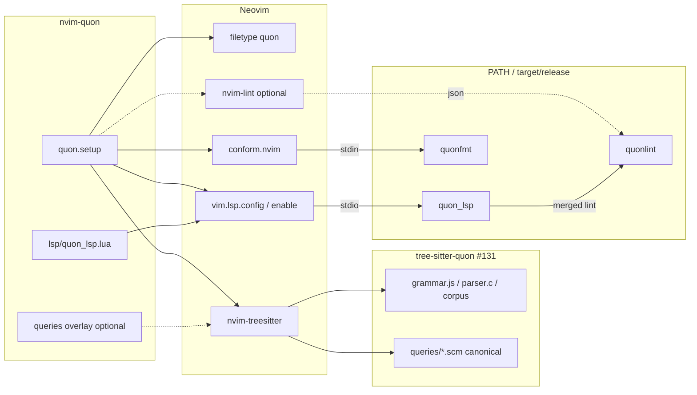

# Issue #133 — Neovim support: Quon LSP, Tree-sitter, formatter, linter

**Role of this document**: implementation plan for an AFK agent (or human).  
**Planner**: this file was authored by the **planning agent** — do **not** treat it as completed implementation.  
**Branch / worktree**: `issue-133` at `.worktrees/issue-133` (from `origin/main`).  
**Issue**: [Neovim support: Quon LSP, Tree-sitter, formatter, and linter integration](https://github.com/arniber21/quon/issues/133)  
**Parent**: #1  
**Labels**: `dev-tooling`, `enhancement`, `ready-for-agent`

**Coordinate with**: #131 (VS Code), #132 (Zed) — **one shared Tree-sitter grammar**, no divergent parsers.  
**Soft-depends**: `tree-sitter-quon/` owned by **#131** (consume-first; see D2). Do **not** invent grammar in #133.  
**Hard deps (landed on trunk as of plan date)**: #43/#44/#45 (`quon_lsp`), #46 (`quonfmt`), #47 (`quonlint`).

**Plan revision**: amended after adversarial review `73f06a23` (shared-grammar contract, treesitter install API, lspconfig/`vim.lsp.config` path, lazy `ft`).

Read first: `CLAUDE.md`, `docs/agents/code-quality.md`, `docs/agents/graphite.md`, `website/src/content/docs/guides/tooling.md`, `quon_lsp/src/lib.rs`, `quonfmt/README.md`, **#131 plan §4–§5.4** (grammar layout pin), this plan, and `gh issue view 133 --repo arniber21/quon`.

---

## 1. Problem statement

Quon already ships editor-agnostic tooling on `main`:

| Binary | Role | Transport / CLI |
|--------|------|-----------------|
| `quon_lsp` | diagnostics (compiler + lint), hover, completion, definition, code actions, semantic tokens | stdio LSP |
| `quonfmt` | canonical format (`stdin`→`stdout`, `-w`, `--check`) | CLI |
| `quonlint` | experiment-quality lint (`--format json\|human\|github`) | CLI (also merged into LSP) |

There is **no** first-party Neovim module, filetype, Tree-sitter registration, or copy-pasteable `lazy.nvim` / packer install path. Users must hand-wire LSP and formatters. Website tooling docs explicitly defer packaging to #131–#133.

Neovim does **not** need a marketplace publish step. Priority: in-repo Lua module + docs that attach `quon_lsp`, highlight via shared Tree-sitter, and format via `quonfmt`.

---

## 2. Verified current state (inspected on `origin/main` @ `9791173`)

Do not re-derive; spot-check only what you touch.

### Already in place

| Area | Location | Relevance |
|------|----------|-----------|
| LSP stdio server | `quon_lsp/` | `cmd = { "quon_lsp" }`; capabilities in `server.rs` |
| Debounce env | `quon_lsp/src/analysis.rs` | `QUON_LSP_DEBOUNCE_MS` (default ~100 ms) |
| Editor wiring sketch | `quon_lsp/src/lib.rs` crate docs | languageId `quon`, ext `.qn` |
| Formatter | `quonfmt/` | stdin format; `-w` write; `--check`; exit 2 on parse error |
| Style notes | `docs/quonfmt-style.md` | 4-space indent, 100-col, LF |
| Linter + JSON | `quonlint/`, `quonlint-cli/` | `JsonOutput { diagnostics: [...] }` with byte `span.start/end` |
| Config discovery | `quonlint/src/config.rs` | upward search for `quonlint.toml` / `.quonlintrc.toml` |
| Tooling user docs | `website/.../guides/tooling.md` | build cmds; links to #131–#133 |
| Bell fixture | `frontend/tests/fixtures/bell_state.qn` | AC smoke target |
| Keywords (lexer) | `frontend/src/lexer.rs` | `fn type let in return match circuit run borrow for if then else true false adjoint controlled par` |
| Comments | lexer | line `-- …`, nested block `{- … -}` |
| Notable ops | lexer | `|>` `<-` `->` `-o` `=>` `@` etc. |
| CI tooling gates | `scripts/tooling-check.sh`, issue #49 | protocol-level LSP only — **no** editor harness yet |
| Local Neovim | host has `NVIM v0.12.3` | sufficient for `vim.lsp.config` + treesitter |

### Not present (the #133 gap)

- No `nvim-quon/` (or any `*.lua` editor package)
- No `docs/agents/editor-setup.md`
- No Tree-sitter grammar / `queries/*.scm` anywhere in-repo
- No `nvim-lspconfig` server snippet, conform adapter, or nvim-lint parser
- No headless Neovim CI job

### Sibling editor issues (coordination)

| Issue | Package shape | Shared asset |
|-------|---------------|--------------|
| #131 VS Code | extension + TextMate; **owns** `tree-sitter-quon/` | **canonical grammar + shared queries** |
| #132 Zed | `extensions/zed-quon/` + WASM LSP hook | consumes grammar; Zed query copies synced from shared |
| #133 Neovim | `nvim-quon/` Lua module | consumes grammar + shared queries; **Neovim overlay only** |

**Rule**: one `tree-sitter-quon` grammar (`grammar.js` / `src/parser.c` / `test/corpus/`) owned by #131. Shared `tree-sitter-quon/queries/*.scm` are canonical. #133 may add a **documented Neovim-only overlay** (extra captures) — never a second `grammar.js` or a forked corpus layout.

---

## 3. Goals and non-goals

### Goals

1. **In-repo Lua module** `nvim-quon/` that users can load via `lazy.nvim` (path/url) or packer.
2. **Filetype** `quon` for `*.qn` with sensible `commentstring`, brackets, and indent defaults aligned with `quonfmt`.
3. **LSP**: register `quon_lsp` (stdio) so `:LspInfo` / `:checkhealth vim.lsp` shows attachment on `.qn` buffers; root = git ancestor **or** nearest `quonlint.toml` / `.quonlintrc.toml`.
4. **Tree-sitter**: register shared Quon parser from `tree-sitter-quon/` (#131); use shared queries; optional documented Neovim overlay only.
5. **Format**: `conform.nvim` (preferred) adapter calling `quonfmt` on stdin; document format-on-save and `:Format` / `ConformInfo`.
6. **Optional lint**: `nvim-lint` bridge for standalone `quonlint --format json` (MVP may skip — LSP already publishes lint diagnostics).
7. **Docs**: `nvim-quon/README.md` + `docs/agents/editor-setup.md` with lazy.nvim **and** packer examples; update website tooling “Editor integration” section.
8. **Optional CI**: headless Neovim smoke that opens `bell_state.qn` and asserts LSP client name / attachment (non-blocking or path-filtered).

### Non-goals (explicit)

- Publishing to luarocks / separate `arniber21/nvim-quon` GitHub repo (optional follow-up; in-repo module is enough for AC).
- Embedding circuit / topology / mapping UIs (#134–#136).
- Reimplementing lint rules or a second formatter.
- Upstream PR to `neovim/nvim-lspconfig` in the same PR (nice-to-have follow-up; in-repo `lsp/quon_lsp.lua` is enough).
- Authoring or forking `tree-sitter-quon/` grammar / corpus (owned by #131).
- Guaranteeing MLIR-free `quon_lsp` builds (server still needs workspace LLVM/Z3 today) — document PATH prerequisites only.
- Perfect parity of Tree-sitter highlights with LSP semantic tokens (semantic tokens win for types/symbols; Tree-sitter covers keywords/structure offline).

---

## 4. Design decisions

### D1 — Package layout: `nvim-quon/` at repo root

```
nvim-quon/
├── README.md                 # install, prerequisites, troubleshooting
├── lua/
│   └── quon/
│       ├── init.lua          # setup(opts) entry
│       ├── filetype.lua      # vim.filetype / ftplugin helpers
│       ├── lsp.lua           # vim.lsp.config / vim.lsp.enable wiring only
│       ├── treesitter.lua    # User TSUpdate + install_info.path/location
│       ├── format.lua        # conform (and optional formatter.nvim) snippets as data
│       ├── lint.lua          # optional nvim-lint
│       └── health.lua        # :checkhealth quon
├── lsp/
│   └── quon_lsp.lua          # rtp catalog entry for vim.lsp.config("quon_lsp")
├── ftdetect/
│   └── quon.lua              # vim.filetype.add({ extension = { qn = "quon" } })
├── ftplugin/
│   └── quon.lua              # commentstring, formatexpr hints
├── queries/                  # OPTIONAL Neovim overlay only (see D2)
│   └── quon/
│       └── *.scm             # only Neovim-specific extras; prefer shared package
└── scripts/
    └── smoke_headless.lua    # optional CI harness
```

**Rationale**: Neovim plugin managers expect a plugin root with `lua/`, `ftdetect/`, `ftplugin/`, and (for modern Neovim) `lsp/`. Keeping it at repo root (sibling to `quon_lsp/`) matches “copy-pasteable / path = …” lazy specs without nesting under `extensions/`.

**Queries**: default to **shared** `tree-sitter-quon/queries/` via treesitter `install_info.queries` (or rtp). Do **not** duplicate the full highlight/indent set under `nvim-quon/queries/` unless a Neovim-only overlay is required — and then document the overlay in README (“synced from / extends shared queries”).

### D2 — Shared Tree-sitter grammar: consume-first (#131 owns)

**Canonical package** (layout pinned to #131 plan §4 / §5.3 — do not invent alternate paths):

```
tree-sitter-quon/                 # SHARED; owned initially by #131
├── grammar.js
├── src/                          # generated parser.c / scanner if needed
├── queries/
│   ├── highlights.scm            # canonical for Zed + Neovim
│   ├── indents.scm               # optional; useful for Neovim
│   └── locals.scm                # optional
├── test/
│   └── corpus/                  # tree-sitter test corpus (.txt)
├── package.json
└── README.md                     # consumption contract for #131/#132/#133
```

**Ownership / consume-first protocol (hard rules for #133)**

| Asset | Owner | #133 action |
|-------|-------|-------------|
| `grammar.js` / `src/parser.c` / `test/corpus/` | **#131** | **Consume only** — never create or fork |
| Shared `queries/*.scm` | **#131** (canonical) | Point nvim-treesitter at them; do not re-author a parallel full set |
| Neovim-only query overlay | **#133** | Allowed only as documented extras under `nvim-quon/queries/quon/` |
| nvim-treesitter registration + install docs | **#133** | `User TSUpdate` + `install_info` (see §6.3) |

**Preflight (blocking for Phase 1+):**

1. Check `tree-sitter-quon/` on `main`, stacked #131 PR, or sibling worktree.
2. **If present:** stack/rebase #133 onto it; wire `nvim-quon` to that path.
3. **If absent:** **stop grammar work** — do **not** scaffold `tree-sitter-quon/` in the #133 PR. Either wait for #131, stack Graphite under the #131 grammar branch, or land a **tiny precursor owned as the #131 grammar commit** (same layout as #131) *before* Neovim packaging — never a Neovim-private grammar.

Do **not** embed `grammar.js` under `nvim-quon/`. Corpus lives at `tree-sitter-quon/test/corpus/` per #131.

### D3 — LSP registration: `lsp/quon_lsp.lua` + `vim.lsp.config` / `enable` only

**Ship** `nvim-quon/lsp/quon_lsp.lua` on the plugin rtp (modern nvim-lspconfig / Neovim 0.11+ catalog form). Registration is **only**:

```lua
vim.lsp.config("quon_lsp", opts)  -- merge user opts over defaults from lsp/quon_lsp.lua
vim.lsp.enable("quon_lsp")
```

**Do not** call `require("lspconfig").quon_lsp.setup(...)` or any dual-path that also invokes the deprecated `.setup()` framework — that risks double-attach and fights Neovim 0.11+.

`nvim-lspconfig` as a **dependency is optional**: if present, it loads `lsp/*.lua` catalog entries; our shipped `lsp/quon_lsp.lua` is the server definition the issue asked for. Prefer documenting Neovim 0.11+ `vim.lsp.config` / `vim.lsp.enable` as the supported path.

Default server table (in `lsp/quon_lsp.lua` and/or merged in `lua/quon/lsp.lua`):

```lua
{
  cmd = { "quon_lsp" },
  filetypes = { "quon" },
  root_markers = { "quonlint.toml", ".quonlintrc.toml", ".git" },
  settings = {},  -- server has no LSP settings schema today
}
```

**Env passthrough** (via `cmd_env` / `vim.lsp.ClientConfig`):

| Env | Purpose |
|-----|---------|
| `QUON_LSP_DEBOUNCE_MS` | analysis debounce (string ms) |
| `RUST_LOG` / `QUON_LOG` | server tracing on stderr |

**Binary discovery** (`opts.cmd` override):

1. User `setup({ cmd = { "/abs/path/quon_lsp" } })`
2. Else `vim.fn.exepath("quon_lsp")` if non-empty
3. Else, if `opts.quon_root` or detected git root of the plugin/repo contains `target/release/quon_lsp` or `target/debug/quon_lsp`, use that (dev ergonomics for monorepo contributors)
4. Else keep `{ "quon_lsp" }` and let `:checkhealth quon` warn

Language ID / filetype must be **`quon`** everywhere (extension `.qn` → filetype `quon`; matches crate docs and website tooling guide). Never use filetype `"qn"`.

### D4 — Formatter: conform.nvim primary; formatter.nvim documented secondary

`quonfmt` already speaks stdin→stdout (ideal for conform):

```lua
formatters = {
  quonfmt = {
    command = "quonfmt",
    stdin = true,
    -- no args needed for stdin mode
  },
},
formatters_by_ft = {
  quon = { "quonfmt" },
},
```

Document:

- `format_on_save` example
- `:ConformInfo` / user command that maps to `require("conform").format()`
- PATH / `command = vim.fn.exepath(...)` override
- **Comment stripping caveat** (link `docs/quonfmt-style.md` / tooling caution)

Do **not** set `formatexpr` to something that shells `quonfmt -w` on the buffer path by default (race with unsaved buffers). Prefer stdin formatters.

### D5 — Optional nvim-lint (off by default)

LSP already runs `quonlint` post-typecheck and publishes diagnostics. Standalone nvim-lint duplicates noise unless the user disables LSP lint (not currently configurable) or works offline without `quon_lsp`.

Ship `lua/quon/lint.lua` behind `setup({ lint = { enable = true } })` default **false**.

Parser notes:

- CLI: `quonlint --format json <file>`
- JSON shape: `{ "diagnostics": [ { "rule", "severity", "message", "span": { "start", "end" }, "help"? } ] }`
- Spans are **byte offsets**, not line/col — nvim-lint custom parser must convert via buffer bytes → `vim.api.nvim_buf_get_offset` / `str_utfindex` carefully (Quon source is UTF-8; fixtures are ASCII-heavy).
- Severities: `error`/`warn`/`info`/`allow` → vim diagnostic severities; skip `allow`.

If conversion is fragile, document “prefer LSP diagnostics” and keep the bridge as best-effort.

### D6 — Docs split

| Doc | Audience |
|-----|----------|
| `nvim-quon/README.md` | Neovim users / plugin consumers |
| `docs/agents/editor-setup.md` | agents + contributors (all editors; Neovim section fleshed out; VS Code/Zed stubs pointing at #131/#132) |
| `website/.../guides/tooling.md` | public docs — replace “No first-party editor package” with Neovim install pointer |

---

## 5. Architecture



**Runtime layering**

1. Tree-sitter: structural / keyword highlight without server (shared queries from #131).
2. LSP semantic tokens: override/refine types and symbols when server is up.
3. LSP diagnostics: compiler + lint (primary).
4. conform: style on save / on demand.
5. nvim-lint: optional duplicate lint path.

---

## 6. Tree-sitter: consume shared grammar + Neovim registration

### 6.1 Grammar scope (MVP) — owned by #131, not #133

#133 does **not** author `grammar.js`. Highlighting-grade coverage (comments, keywords, idents, numbers, operators, `circuit`/`run`/`borrow` blocks) is defined in the #131 plan. Corpus lives at **`tree-sitter-quon/test/corpus/`**.

Implementer checks: shared package present; `npx tree-sitter test` (or documented script) passes on the #131 corpus subset. Gaps are #131 follow-ups unless a query-only overlay fixes Neovim captures.

### 6.2 Queries: shared first, Neovim overlay only

**Canonical** (from #131): `tree-sitter-quon/queries/highlights.scm`, `indents.scm`, optional `locals.scm`.

**Neovim overlay** (optional, #133 only): extra `@capture`s under `nvim-quon/queries/quon/` **only** when shared queries are insufficient for nvim-treesitter. Document in `nvim-quon/README.md`: “extends shared queries; do not fork node names.” Prefer contributing capture fixes upstream into `tree-sitter-quon/queries/` when they are editor-neutral.

Minimum captures expected (usually already in shared highlights):

- `@keyword`, `@keyword.function`, `@keyword.return`, `@keyword.conditional`, `@keyword.repeat`
- `@function`, `@type`, `@variable`, `@property` (as applicable)
- `@operator`, `@punctuation.bracket`, `@punctuation.delimiter`
- `@number`, `@boolean`, `@comment`, `@constant` / builtins if distinguished

`injections.scm`: stub / empty unless a clear injection target appears (none today).

### 6.3 Registration snippet (`lua/quon/treesitter.lua`) — modern API only

**Do not** use deprecated `require("nvim-treesitter.parsers").get_parser_configs()`. Register via **`User TSUpdate`** and `install_info.path` / `location`:

```lua
-- Resolve monorepo root (plugin dir → parent, or opts.treesitter.parser_path / quon_root).
local quon_root = opts.quon_root or vim.fs.dirname(plugin_root)
local grammar_path = opts.treesitter.parser_path  -- override: abs path to tree-sitter-quon
  or (quon_root .. "/tree-sitter-quon")

vim.api.nvim_create_autocmd("User", {
  pattern = "TSUpdate",
  callback = function()
    require("nvim-treesitter.parsers").quon = {
      install_info = {
        -- Preferred for monorepo checkout of tree-sitter-quon itself:
        path = grammar_path,
        -- If instead pointing path at the quon repo root, set:
        -- path = quon_root,
        -- location = "tree-sitter-quon",
        queries = "queries",  -- symlink/install shared queries from the package
        -- generate = false when src/parser.c is committed (#131 policy)
      },
      tier = 2,
    }
  end,
})
```

**Monorepo install rules (copy-pasteable):**

| Situation | `install_info` |
|-----------|----------------|
| `path` = absolute dir of `tree-sitter-quon/` | `path = "…/tree-sitter-quon"`; no `location` |
| `path` = absolute quon repo root | `path = "…/quon"`, `location = "tree-sitter-quon"` |
| Remote mirror (follow-up) | `url` + `revision` + optional `location` |

After registration, document `:TSInstall quon` (or ensure_installed). Prefer committed `src/parser.c` from #131 so users need not `generate = true`.

**filetype**: parser language name `quon` maps to filetype **`quon`** (extension `.qn`).

---

## 7. LSP wiring details

### 7.1 Ship `lsp/quon_lsp.lua` + `lua/quon/lsp.lua`

**`nvim-quon/lsp/quon_lsp.lua`**: returns / defines the default server config table (cmd, filetypes `{ "quon" }`, root_markers). This is the lspconfig-shaped catalog entry on rtp.

**`lua/quon/lsp.lua` responsibilities:**

- Merge `opts.lsp` over defaults.
- Resolve `cmd` per D3.
- Call **only** `vim.lsp.config("quon_lsp", merged)` then `vim.lsp.enable("quon_lsp")`.
- **Never** call `lspconfig.quon_lsp.setup` / `require("lspconfig").quon_lsp.setup`.
- Root markers: nearest `quonlint.toml` / `.quonlintrc.toml`, else `.git`, else buffer directory (via `root_markers` / Neovim root detection).
- Do **not** disable `textDocument/publishDiagnostics`.
- Optional `on_attach` for user keymaps (document suggested `gd` / `K` / `gra`; do not force global maps).

### 7.2 Health check

`lua/quon/health.lua` (or `checkhealth` via `vim.health`):

- Neovim version ≥ 0.11 recommended (`vim.lsp.config` / `enable`); warn below 0.11
- `quon_lsp` / `quonfmt` / `quonlint` on PATH or resolved
- `lsp/quon_lsp.lua` present on rtp
- nvim-treesitter present if `opts.treesitter.enable`
- conform present if `opts.format.enable`

### 7.3 Capabilities checklist (AC mapping)

| Capability | Server | Neovim verification |
|------------|--------|---------------------|
| diagnostics | publishDiagnostics | open `bell_state.qn`; introduce typo; see diagnostic |
| hover | hoverProvider | `K` / `vim.lsp.buf.hover` on `CNOT` / `bell_state` |
| completion | completionProvider (`@` `:` `<`) | insert mode triggers |
| definition | definitionProvider | `gd` on `bell_state` call site |
| code actions | codeActionProvider | `gra` / lightbulb on known quickfix fixture if available |
| semantic tokens | semanticTokensProvider full | `:Inspect` / highlight difference vs TS-only |

**AC note:** `:LspInfo` may be deprecated on newer Neovim in favor of `:checkhealth vim.lsp` / client list APIs — verify attachment via `vim.lsp.get_clients({ name = "quon_lsp" })` as well; still satisfy the issue’s `:LspInfo` wording where the command exists.

---

## 8. Formatter & linter integration

### 8.1 conform (required for AC)

`setup({ format = { enable = true, format_on_save = false } })` — default **off** for format-on-save (comment-stripping hazard); document how to enable.

Provide `require("quon").format()` thin wrapper → `conform.format({ filetype = "quon" })` when conform is loaded, else notify.

AC “`:Format`” — either:

- document that users map `:Format` → conform, **or**
- create `vim.api.nvim_create_user_command("Format", …)` when `opts.format.user_command = true` (default true).

### 8.2 nvim-lint (optional)

Default off. When enabled:

```lua
require("lint").linters.quonlint = { … }
require("lint").linters_by_ft.quon = { "quonlint" }
-- autocmd BufWritePost / InsertLeave → lint
```

Document conflict: duplicate diagnostics with LSP — recommend enabling only one.

---

## 9. Install documentation (lazy.nvim + packer)

### 9.1 lazy.nvim (primary example)

```lua
{
  dir = "/path/to/quon/nvim-quon",  -- or git URL later
  name = "nvim-quon",
  ft = "quon",  -- filetype name is "quon" (extension .qn) — NOT ft = "qn"
  dependencies = {
    -- "neovim/nvim-lspconfig",    -- optional; catalog loads lsp/*.lua when present
    "nvim-treesitter/nvim-treesitter",
    "stevearc/conform.nvim",
    -- "mfussenegger/nvim-lint",   -- optional
  },
  opts = {
    lsp = {
      -- cmd = { vim.fn.expand("~/projects/quon/target/release/quon_lsp") },
      cmd_env = { QUON_LSP_DEBOUNCE_MS = "100" },
    },
    treesitter = { enable = true },
    format = { enable = true, format_on_save = false },
    lint = { enable = false },
  },
  config = function(_, opts)
    require("quon").setup(opts)
  end,
}
```

**Filetype / languageId invariant:** extension `.qn` → filetype **`quon`** → LSP `filetypes = { "quon" }` → languageId **`quon`**. Lazy `ft = "quon"` (or `event` that opens `*.qn` after ftdetect). Using `ft = "qn"` never loads the plugin → LSP never attaches → AC fails.

Also show **URL** form once/if mirrored: `{ "arniber21/quon", rtp = "nvim-quon", … }` only if lazy supports subdirectory rtp — if not, document `dir =` clone path as the supported monorepo workflow.

### 9.2 packer.nvim (AC required)

```lua
use {
  "/path/to/quon/nvim-quon",
  requires = { "nvim-treesitter/nvim-treesitter", "stevearc/conform.nvim" },
  config = function()
    require("quon").setup({})
  end,
}
```

### 9.3 Prerequisites section (both docs)

```sh
cargo build --release -p quon_lsp -p quonfmt -p quonlint-cli
export PATH="$PWD/target/release:$PATH"
```

Note LLVM 22 + Z3 for `quon_lsp` (same as website tooling guide). `quonfmt` alone is MLIR-free.

### 9.4 Troubleshooting

| Symptom | Check |
|---------|-------|
| LSP not attaching | `:LspInfo` / `:checkhealth quon`; filetype is `quon` not `qn` |
| `cmd` not found | PATH / `opts.lsp.cmd` |
| No highlights | `:TSInstall quon` / parser path; `:InspectTree` |
| Format no-op | conform installed; `quonfmt` on PATH; parse error exit 2 |
| Duplicate lint | disable `opts.lint` |

---

## 10. Optional headless CI

### 10.1 Scope (optional AC)

Add a **non-blocking** or path-filtered job that:

1. Builds `quon_lsp` (reuse tooling job LLVM setup from #49 / `ci.yml` `tooling` job if present).
2. Installs Neovim (apt / download stable AppImage / `nickgnd/install-neovim-action` — pick one maintained action at implement time).
3. Runs `nvim --headless -u nvim-quon/scripts/smoke_minimal_init.lua -c "luafile nvim-quon/scripts/smoke_headless.lua" -c qa`.

### 10.2 Smoke script assertions (minimal)

`smoke_headless.lua`:

1. `vim.cmd.edit("frontend/tests/fixtures/bell_state.qn")`
2. Wait until `vim.lsp.get_clients({ name = "quon_lsp", bufnr = 0 })` is non-empty (poll ≤ 10s)
3. Request hover or definition via `vim.lsp.buf_request_sync` on a known position (e.g. `bell_state` ident)
4. `print("OK")` or `vim.cmd.cquit(1)` on failure

**Do not** require GUI, conform, or treesitter compile in v1 CI if parser WASM/build is heavy — LSP attach alone satisfies the optional AC spirit. Treesitter `:TSInstall` in CI is a stretch goal.

### 10.3 Workflow placement

Prefer extending existing tooling workflow with `continue-on-error: true` initially, or a new `neovim-smoke.yml` triggered on `nvim-quon/**` + `tree-sitter-quon/**` paths. Do not slow the main `rust` job.

---

## 11. Implementation phases

### Phase 0 — Preflight (30–60 min)

- [ ] Confirm `cargo build -p quon_lsp -p quonfmt -p quonlint-cli` works in the agent environment (LLVM 22).
- [ ] **Grammar gate:** confirm `tree-sitter-quon/` exists on `main` / #131 PR / stacked branch with #131 layout (`test/corpus/`, `queries/`, committed `src/parser.c`). If missing → **do not create grammar in #133**; wait or stack under #131.
- [ ] Confirm Neovim ≥ 0.11 available for local smoke (`vim.lsp.config` / `enable`).

### Phase 1 — Consume shared grammar (no authorship)

- [ ] Wire paths only: document / resolve abs path to existing `tree-sitter-quon/`.
- [ ] Spot-check shared `queries/highlights.scm` + `test/corpus/` layout matches #131 pin.
- [ ] Do **not** add `grammar.js` or alternate corpus paths in this issue’s PR.

### Phase 2 — `nvim-quon` skeleton + LSP catalog

- [ ] `ftdetect` + `ftplugin` (filetype **`quon`**) + `lua/quon/init.lua` `setup(opts)`.
- [ ] Ship `lsp/quon_lsp.lua`; `lsp.lua` uses `vim.lsp.config` + `vim.lsp.enable` only (no `.setup()`).
- [ ] Health check + cmd resolution.
- [ ] Manual: open `bell_state.qn`, verify client `quon_lsp` / `:LspInfo` or `:checkhealth vim.lsp`.

### Phase 3 — Treesitter registration (+ optional overlay)

- [ ] `treesitter.lua`: `User TSUpdate` + `install_info.path` / `location` (see §6.3); `:TSInstall quon`.
- [ ] Prefer shared queries; add Neovim overlay under `nvim-quon/queries/quon/` only if needed and documented.
- [ ] Visual check highlights on bell + one larger fixture.

### Phase 4 — Formatter (+ optional lint)

- [ ] conform adapter + `:Format` user command.
- [ ] Docs for format-on-save + comment caveat.
- [ ] Optional `lint.lua` behind flag.

### Phase 5 — Documentation

- [ ] `nvim-quon/README.md` (lazy with `ft = "quon"` + packer).
- [ ] `docs/agents/editor-setup.md`.
- [ ] Update `website/src/content/docs/guides/tooling.md` editor section.
- [ ] Cross-link from root `README.md` Developer tooling blurb if appropriate (keep diff small).

### Phase 6 — Optional CI + PR hygiene

- [ ] Headless smoke script + workflow (optional).
- [ ] `cargo fmt` / clippy / tests unchanged (Lua-only PR should not need Rust test churn).
- [ ] Taskless only if Rust touched; otherwise N/A.
- [ ] Graphite: `gt create` / `gt submit` from `issue-133` (not from local `main`); stack under #131 grammar branch if grammar not yet on `main`.

---

## 12. File-level deliverables

| Path | Action |
|------|--------|
| `tree-sitter-quon/**` | **Consume only** (owned by #131) — do not add/fork in #133 |
| `nvim-quon/**` | **Add** Lua plugin module |
| `nvim-quon/lsp/quon_lsp.lua` | **Add** — vim.lsp / lspconfig catalog entry |
| `docs/agents/editor-setup.md` | **Add** |
| `docs/plans/issue-133-plan.md` | This plan |
| `website/src/content/docs/guides/tooling.md` | **Update** editor integration status |
| `.github/workflows/*` | **Optional** neovim smoke |
| `README.md` | **Optional** one-line pointer |

No changes required to `quon_lsp` / `quonfmt` / `quonlint` **unless** a bug is found during Neovim integration (e.g. root URI handling) — prefer editor-side workarounds first.

---

## 13. Acceptance criteria (mapped)

| AC | How to verify |
|----|----------------|
| `:LspInfo` shows `quon_lsp` on `.qn` | Open fixture; client name `quon_lsp`, filetype `quon` |
| Diagnostics / hover / completion / go-to-def on bell-state | Manual or headless smoke on `frontend/tests/fixtures/bell_state.qn` |
| `:Format` / format-on-save uses `quonfmt` | Format buffer; output matches `quonfmt` CLI stdin result |
| Install docs: lazy.nvim **and** packer | Present in `nvim-quon/README.md` (+ agent doc) |
| Grammar shared with VS Code/Zed | Consumes single `tree-sitter-quon/` (#131 layout: `test/corpus/`, shared `queries/`); no second grammar; Neovim overlay documented if any |
| Optional headless CI | Workflow + script exist **or** explicitly deferred in PR with rationale |

---

## 14. Risks and mitigations

| Risk | Impact | Mitigation |
|------|--------|------------|
| Divergent Tree-sitter grammars across #131–#133 | Triple maintenance | #131 owns `tree-sitter-quon/`; #133 consume-first; no grammar authorship in this issue |
| Grammar not yet on `main` | Blocks TS highlights | Stack under #131; ship LSP+format first if needed; do not invent grammar |
| Wrong treesitter install API | Install breakage | Ship `User TSUpdate` + `path`/`location` only; no `get_parser_configs` |
| Dual lspconfig `.setup()` + `vim.lsp.config` | Double-attach | `lsp/quon_lsp.lua` + config/enable only |
| lazy `ft = "qn"` | Plugin never loads | Docs/examples use `ft = "quon"`; filetype/languageId = `quon` |
| `quon_lsp` not on PATH for casual users | LSP never starts | Dev path discovery + health warnings + docs |
| `quonfmt` strips comments | Surprise data loss on format-on-save | Default `format_on_save = false`; loud README caution |
| Duplicate diagnostics (LSP + nvim-lint) | Noise | Lint off by default |
| Byte-offset JSON → nvim-lint | Wrong ranges | Prefer LSP; mark bridge experimental |
| Headless CI flaky / heavy LLVM | CI pain | Optional, `continue-on-error`, path filters |
| lazy.nvim subdirectory install awkward | Bad UX | Document `dir =` monorepo path as primary |
| Grammar incomplete vs chumsky | Ugly `ERROR` highlights | #131 corpus triage; semantic tokens cover gaps when LSP up |

---

## 15. Suggested `setup()` option schema

```lua
---@class quon.Opts
---@field lsp quon.LspOpts|false
---@field treesitter quon.TsOpts|false
---@field format quon.FormatOpts|false
---@field lint quon.LintOpts|false

---@class quon.LspOpts
---@field enable boolean|nil          -- default true
---@field cmd string[]|nil
---@field cmd_env table<string,string>|nil
---@field root_markers string[]|nil
---@field on_attach function|nil
---@field capabilities table|nil

---@class quon.TsOpts
---@field enable boolean|nil          -- default true
---@field parser_path string|nil      -- override tree-sitter-quon path

---@class quon.FormatOpts
---@field enable boolean|nil          -- default true
---@field format_on_save boolean|nil  -- default false
---@field user_command boolean|nil    -- default true → :Format
---@field command string|nil          -- quonfmt path

---@class quon.LintOpts
---@field enable boolean|nil          -- default false
---@field command string|nil
```

`require("quon").setup({})` enables LSP + treesitter + conform wiring with safe defaults; lint stays off.

---

## 16. Out-of-scope follow-ups (do not implement in #133)

- Publish standalone `arniber21/nvim-quon` mirror repo + luarocks
- Upstream `neovim/nvim-lspconfig` server contribution
- Mason.nvim registry entries for `quon_lsp` / `quonfmt`
- DAP / test runner / quonc watch integration (#48)
- Visualization hooks (#134–#136)
- TextMate grammar (VS Code #131)

---

## 17. PR / Graphite notes

- Work on branch `issue-133` in `.worktrees/issue-133` (already created from `origin/main`).
- **Stack under #131** (or the grammar precursor) when `tree-sitter-quon/` is not yet on `main`. Do not land a competing grammar PR from this issue.
- Single PR for `nvim-quon` + docs is fine once grammar is available to consume.
- Do not commit from local `main`; use `gt submit --no-interactive --no-edit` (draft OK until manual Neovim smoke passes).

---

## 18. Review amendment checklist (`73f06a23`)

| # | Blocker | Plan fix |
|---|---------|----------|
| 1 | Shared-grammar contract vs #131/#132 | D2 + §6: consume-first; #131 paths (`test/corpus/`, shared `queries/`); Neovim overlay only; no grammar invent in #133 |
| 2 | Treesitter install snippet stale | §6.3: `User TSUpdate` + `install_info.path` / `location`; no `get_parser_configs` |
| 3 | lspconfig dual `.setup()` / missing catalog | D3 + §7: ship `lsp/quon_lsp.lua`; `vim.lsp.config`/`enable` only |
| 4 | lazy `ft = "qn"` | §9.1: `ft = "quon"`; filetype/languageId = `quon` everywhere |

---

## 19. Planner sign-off

This document is the **full implementation plan** for issue #133 (amended for re-review). It does **not** implement Neovim support. Next roles:

1. **Plan reviewer** — re-check blockers 1–4 above.
2. **Implementer** — execute phases 0–6 in the worktree after plan approval.
3. **Code reviewer** — adversarial review against ACs and shared-grammar constraint with #131/#132.
