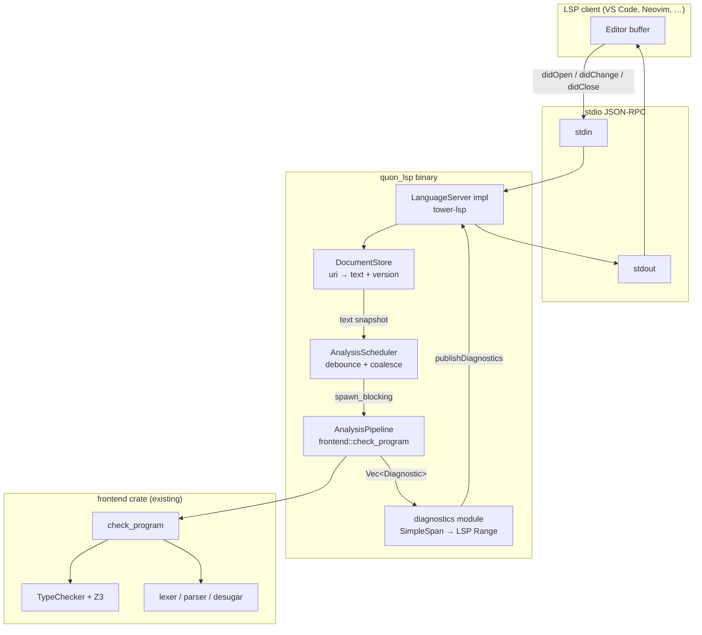

# Issue #43 — LSP foundation: `quon_lsp` crate + incremental analysis pipeline

**Audience**: an agent or human implementing issue #43 in the Quon workspace.  
**Branch**: `issue-43-lsp-foundation` (Graphite stack on `main`).  
**Objective**: ship a standalone stdio LSP server that type-checks `.qn` buffers on every edit and publishes span-accurate diagnostics — no MLIR lowering, no full recompilation.

**Plan status**: amended after adversarial review — see `docs/plans/issue-43-plan-review.md` (Grade B- FAIL → amended for **A-** implementation readiness).

**Blockers**: GitHub #43 lists blockers #7, #9–#12, #14, #15 — all **CLOSED** as of 2026-07-08. Implementation is unblocked.

Read first: `CONTEXT.md`, `docs/agents/code-quality.md`, `docs/agents/validation.md`, `frontend/src/lib.rs`, `frontend/src/diagnostics.rs`, `quonc/src/main.rs`.

---

## 1. Problem statement

Editors need sub-second feedback while writing Quon. Today the only path is `quonc`, which reads a file from disk and runs the full compile pipeline (parse → type-check → lower → MLIR passes → QASM). That is far too heavy for interactive editing.

Issue #43 establishes the **foundation layer**: a `quon_lsp` binary that speaks LSP over stdio, keeps an in-memory document cache, applies incremental edits, and re-runs the **frontend analysis seam** (`frontend::check_program`) on every change cycle. Lowering and backend passes are explicitly out of scope.

---

## 2. Architecture



**Data flow on edit**

1. Client sends `textDocument/didChange` with one or more `TextDocumentContentChangeEvent`s (incremental sync).
2. `DocumentStore` applies edits to the cached UTF-8 string and bumps the LSP version.
3. `AnalysisScheduler` coalesces rapid edits (debounce ~100 ms in production) and schedules one analysis job per URI.
4. Analysis runs `frontend::check_program(&text)` on a blocking thread pool (`tokio::task::spawn_blocking`).
5. Each `frontend::Diagnostic` is mapped to `lsp_types::Diagnostic` with a correct `Range`.
6. Server calls `Client::publish_diagnostics(uri, diags, version)`.

**Explicit non-goals for #43**

- Completion, hover, go-to-definition, semantic tokens
- Workspace symbols, multi-file project model, `Cargo.toml`-style dependency graph
- MLIR lowering or pass pipeline
- File watching / `textDocument/didSave` (optional stub only)

---

## 3. Existing APIs to reuse

### 3.1 Frontend facade (`frontend/src/lib.rs`)

| Function | Use in LSP? | Notes |
| -------- | ----------- | ----- |
| `parse_program` | Optional (debug) | Stops at parse; misses type errors |
| `desugar_program` | Optional (debug) | Stops before type-check |
| **`check_program`** | **Primary** | Parse + desugar + type-check → `Result<(), Vec<Diagnostic>>` |
| `lower_program_to_mlir` | **No** | Pulls Melior/MLIR; too slow for edit loop |

```rust
// frontend/src/lib.rs — the LSP analysis entry point
pub fn check_program(src: &str) -> Result<(), Vec<Diagnostic>>
```

On success: publish empty diagnostics (or clear previous).  
On failure: map each `Diagnostic` to LSP.

### 3.2 Diagnostic shape (`frontend/src/diagnostics.rs`)

```rust
pub struct Diagnostic {
    pub message: String,
    pub span: SimpleSpan,  // chumsky::span::SimpleSpan
}
```

- Spans are **byte offsets** into the source string (`start..end`), verified in `frontend/tests/lexer.rs` (e.g. `#` at byte 2).
- Lexer, parser, desugar, and type-checker all funnel into this type via `from_stage` or `TypeError::to_diagnostic()`.

### 3.3 Reference: CLI diagnostic rendering (`quonc/src/main.rs`)

`print_diagnostics` passes `diag.span.start..diag.span.end` to ariadne as byte ranges over the source. The LSP mapper must perform the inverse: byte offset → `(line, character)`.

### 3.4 What *not* to call

`frontend::lower::lower_program` allocates a Melior `Context`, runs the full lowering path, and is what `quonc` uses for compilation. Keep it out of the hot path.

### 3.5 Canonical test fixtures (valid Quon syntax)

The parser **requires** an explicit return type (`:` + `ty` before `=`). Do **not** use `fn f(x: Int) = …` — that is a parse error.

Use patterns from `frontend/tests/typecheck.rs`:

| Fixture | Diagnostic | Needle byte offset |
| ------- | ---------- | ------------------ |
| `"fn f(): Int = ghost"` | unbound variable | `ghost` at byte **14** |
| `"fn f(x: Int): Int = x + y\n"` | unbound `y` | `y` at byte **24** |

Always compute offsets with `src.find(needle)` in tests — never hard-code from memory.

---

## 4. Crate structure

```
quon_lsp/
├── Cargo.toml
├── src/
│   ├── main.rs           # #[tokio::main], tracing init, Server::serve(stdin, stdout)
│   ├── lib.rs            # crate root; re-exports for integration tests
│   ├── server.rs         # QuonLanguageServer: impl LanguageServer
│   ├── document.rs       # DocumentStore, Document, apply_incremental_changes
│   ├── analysis.rs       # AnalysisScheduler, run_analysis
│   ├── diagnostics.rs    # diagnostic_to_lsp, check_to_lsp_diags
│   └── span.rs           # LineIndex wrapper over line-index crate
└── tests/
    ├── support/
    │   └── lsp_client.rs # JSON-RPC framing client + notification reader
    ├── handshake.rs      # initialize → initialized → shutdown → exit (CI)
    ├── incremental_lsp.rs  # didOpen + didChange → diagnostics update
    ├── document.rs       # DocumentStore unit tests (apply_changes)
    └── span_mapping.rs   # unit tests for byte→line/col edge cases
```

### 4.1 `Cargo.toml`

```toml
[package]
name    = "quon_lsp"
version = "0.1.0"
edition = "2024"

[[bin]]
name = "quon_lsp"
path = "src/main.rs"

[dependencies]
frontend   = { path = "../frontend" }
tower-lsp  = { workspace = true }
tokio      = { workspace = true, features = ["rt-multi-thread", "macros", "sync", "time"] }
line-index = { workspace = true }
thiserror  = { workspace = true }
tracing    = { workspace = true }
tracing-subscriber = { workspace = true, features = ["env-filter"] }

[dev-dependencies]
serde_json = { workspace = true }

# Binary-only: anyhow for top-level error printing (mirrors quonc)
[dependencies.anyhow]
workspace = true
optional  = false
```

Add to root `Cargo.toml`:

```toml
members = [..., "quon_lsp"]

[workspace.dependencies]
tower-lsp  = "0.20"   # pins lsp-types ~0.94; verify latest compatible on implement
tokio      = { version = "1", features = ["rt-multi-thread", "macros", "sync", "time", "io-util"] }
line-index = "0.1"
tracing    = "0.1"
tracing-subscriber = { version = "0.3", features = ["env-filter"] }
```

**Dependency notes**

| Crate | Role |
| ----- | ---- |
| `tower-lsp` | LSP server framework; re-exports `lsp_types` and JSON-RPC types |
| `lsp-types` | Comes transitively via `tower-lsp`; use `tower_lsp::lsp_types::*` |
| `tokio` | Async runtime for stdio transport and debounce timers |
| `line-index` | UTF-16-aware line/column indexing (rust-analyzer proven) |
| `frontend` | `check_program` + `Diagnostic` |
| `thiserror` | Error types in library modules (`quon_lsp` is a library + binary) |
| `anyhow` | **Binary only** (`main.rs`) for top-level error printing |

Do **not** add direct dependencies on `melior`, `mlir_bridge`, or `backend`.

### 4.2 Taskless rule update (required in step 6.10)

The existing `no-anyhow-in-lib-src` rule only ignores `quonc/**`. Extend it to mirror the quonc exception:

```yaml
# .taskless/rules/no-anyhow-in-lib-src.yml — add to ignores:
  - "quon_lsp/**"
```

Library modules under `quon_lsp/src/` (everything except `main.rs`) must still use `thiserror` — the ignore covers the binary entry point only, same as `quonc`.

---

## 5. Key types and modules

### 5.1 `Document` and `DocumentStore` (`document.rs`)

```rust
pub struct Document {
    pub uri: Url,
    pub text: String,
    pub version: i32,
    /// Used only for LSP Position → byte offset during incremental edit application.
    /// Rebuilt after every text mutation. Analysis rebuilds its own LineIndex from snapshot.
    pub line_index: LineIndex,
}

pub struct DocumentStore {
    open: HashMap<Url, Document>,
}

impl DocumentStore {
    pub fn open(&mut self, uri: Url, text: String, version: i32) -> &Document;
    pub fn close(&mut self, uri: &Url);
    pub fn apply_changes(
        &mut self,
        uri: &Url,
        version: Option<i32>,
        changes: &[TextDocumentContentChangeEvent],
    ) -> Option<&Document>;
}
```

**Incremental edit application**

LSP incremental changes carry an optional `range` + `text`. When `range` is `None`, the change replaces the entire document (full-sync fallback).

```rust
fn apply_change(full: &mut String, range: Option<Range>, new_text: &str, line_index: &LineIndex) {
    match range {
        None => {
            *full = new_text.to_owned();
        }
        Some(r) => {
            let start = line_index.offset(r.start);
            let end = line_index.offset(r.end);
            full.replace_range(start..end, new_text);
        }
    }
}
```

After every mutation, rebuild `LineIndex` from `text`.

**Unknown URI**: `did_change` / `did_close` on a URI not in the store should log at `debug` and no-op — never panic.

### 5.2 `LineIndex` (`span.rs`)

Thin wrapper over the `line-index` crate:

```rust
use line_index::{LineCol, LineIndex as RawLineIndex, WideEncoding};

pub struct LineIndex {
    inner: RawLineIndex,
}

impl LineIndex {
    pub fn new(text: &str) -> Self {
        Self {
            inner: RawLineIndex::new(text),
        }
    }

    /// LSP Position → byte offset (for incremental edit application).
    pub fn offset(&self, pos: tower_lsp::lsp_types::Position) -> usize {
        self.inner
            .offset(LineCol {
                line: pos.line,
                col: pos.character,
            })
            .into()
    }

    /// Byte offset → LSP Position (for diagnostic mapping).
    pub fn position(&self, offset: usize) -> tower_lsp::lsp_types::Position {
        let lc = self.inner.line_col(offset.into(), WideEncoding::Utf16);
        tower_lsp::lsp_types::Position {
            line: lc.line,
            character: lc.col,
        }
    }
}
```

**UTF-16 requirement**: LSP `character` is a UTF-16 code unit offset. Quon identifiers are ASCII-only (`text::ascii::ident()` in `frontend/src/lexer.rs`), so ASCII source matches byte/char offsets on each line. Tests must still cover:

- Unicode in **comments** (`-- café`) and **string literals**
- `\r\n` line endings
- Tab characters (one UTF-16 code unit each)

Do **not** test emoji identifiers — they are rejected by the lexer today.

### 5.3 Span → LSP Range mapping (`diagnostics.rs`)

```rust
use frontend::diagnostics::Diagnostic;
use tower_lsp::lsp_types::{Diagnostic as LspDiagnostic, DiagnosticSeverity, Range};

pub fn diagnostic_to_lsp(diag: &Diagnostic, source: &str, line_index: &LineIndex) -> LspDiagnostic {
    let span = diag.span;
    // Clamp span end to source length before indexing
    let end = span.end.min(source.len());
    let start = span.start.min(end);
    let start_pos = line_index.position(start);
    let end_pos = line_index.position(end);
    LspDiagnostic {
        range: Range { start: start_pos, end: end_pos },
        severity: Some(DiagnosticSeverity::ERROR),
        code: None,
        code_description: None,
        source: Some("quon".into()),
        message: diag.message.clone(),
        related_information: None,
        tags: None,
        data: None,
    }
}

pub fn check_to_lsp_diags(
    src: &str,
    result: Result<(), Vec<Diagnostic>>,
    line_index: &LineIndex,
) -> Vec<LspDiagnostic> {
    match result {
        Ok(()) => vec![],
        Err(diags) => diags.iter().map(|d| diagnostic_to_lsp(d, src, line_index)).collect(),
    }
}
```

**Mapping invariant** (must match `frontend/tests/typecheck.rs` helpers):

For ASCII source, if `needle` is at byte `start..end`, then the LSP range should cover exactly that token. Add a cross-crate test:

```rust
let src = "fn f(x: Int): Int = x + y\n";  // y is unbound
let diags = frontend::check_program(src).unwrap_err();
let needle_start = src.find('y').expect("y in source");
let lsp = diagnostic_to_lsp(&diags[0], src, &LineIndex::new(src));
assert_eq!(lsp.range.start.line, 0);
assert_eq!(lsp.range.start.character, needle_start as u32); // ASCII: byte == utf16 col
```

**Edge cases**

| Case | Behavior |
| ---- | -------- |
| Empty span `0..0` | Zero-width range at start of file (lowering internal errors — rare in `check_program`) |
| Span past EOF | Clamp `end` to `text.len()` before indexing |
| Multiple diagnostics | Publish all; preserve order |
| Overlapping spans | Allowed; LSP clients render all |

### 5.4 `AnalysisScheduler` (`analysis.rs`)

`tower_lsp::LanguageServer` methods take `&self`. All mutable scheduler state lives behind interior mutability:

```rust
struct SchedulerState {
    debounce: Duration,
    /// Per-URI debounce task handle; abort on new edit to coalesce.
    pending: HashMap<Url, tokio::task::JoinHandle<()>>,
}

pub struct AnalysisScheduler {
    state: Arc<Mutex<SchedulerState>>,
    client: Client,
    documents: Arc<RwLock<DocumentStore>>,
}

impl AnalysisScheduler {
    /// Called from LanguageServer `&self` handlers.
    pub fn request_analysis(&self, uri: Url) {
        let state = Arc::clone(&self.state);
        let client = self.client.clone();
        let documents = Arc::clone(&self.documents);

        let mut guard = self.state.lock().expect("scheduler mutex poisoned");
        if let Some(handle) = guard.pending.remove(&uri) {
            handle.abort();
        }
        let debounce = guard.debounce;
        let handle = tokio::spawn(async move {
            tokio::time::sleep(debounce).await;
            // Snapshot document under read lock
            let (text, version) = {
                let docs = documents.read().expect("documents poisoned");
                let doc = docs.open.get(&uri)?;
                (doc.text.clone(), doc.version)
            };
            let client = client.clone();
            let uri = uri.clone();
            let current_version = version;
            tokio::task::spawn_blocking(move || {
                let result = frontend::check_program(&text);
                let line_index = LineIndex::new(&text);
                let lsp_diags = check_to_lsp_diags(&text, result, &line_index);
                // Publish on async runtime
                tokio::spawn(async move {
                    client.publish_diagnostics(uri, lsp_diags, Some(current_version)).await;
                });
            }).await.ok();
        });
        guard.pending.insert(uri, handle);
    }
}
```

**Debounce configuration**

| Context | Debounce |
| ------- | -------- |
| Production default | `Duration::from_millis(100)` |
| Integration tests | `Duration::ZERO` via `SchedulerState { debounce: Duration::ZERO, .. }` |
| Local override | `QUON_LSP_DEBOUNCE_MS` env var (optional; tests must not depend on it) |

**Version guard**: after `spawn_blocking` completes, re-read document version; discard publish if `current_version < doc.version`.

**Coalescing**: abort the per-URI debounce task on each new edit (shown above). In-flight `spawn_blocking` jobs finish but version guard drops stale publishes.

### 5.5 `QuonLanguageServer` (`server.rs`)

```rust
pub struct QuonLanguageServer {
    client: Client,
    documents: Arc<RwLock<DocumentStore>>,
    scheduler: AnalysisScheduler,
}

#[tower_lsp::async_trait]
impl LanguageServer for QuonLanguageServer {
    async fn initialize(&self, _: InitializeParams) -> Result<InitializeResult> { ... }
    async fn initialized(&self, _: InitializedParams) { }
    async fn shutdown(&self) -> Result<()> { Ok(()) }

    async fn did_open(&self, params: DidOpenTextDocumentParams) { ... }
    async fn did_change(&self, params: DidChangeTextDocumentParams) { ... }
    async fn did_close(&self, params: DidCloseTextDocumentParams) { ... }
}
```

**`initialize` capabilities**

```rust
ServerCapabilities {
    text_document_sync: Some(TextDocumentSyncCapability::Options(
        TextDocumentSyncOptions {
            open_close: Some(true),
            change: Some(TextDocumentSyncKind::INCREMENTAL),
            save: None,
            ..Default::default()
        },
    )),
    ..Default::default()
}
```

**`did_close`**: remove from `DocumentStore`; publish empty diagnostics to clear squiggles:

```rust
self.client.publish_diagnostics(uri, vec![], None).await;
```

### 5.6 `main.rs`

```rust
#[tokio::main]
async fn main() -> anyhow::Result<()> {
    tracing_subscriber::fmt()
        .with_env_filter(tracing_subscriber::EnvFilter::from_default_env())
        .with_writer(std::io::stderr)  // NEVER log to stdout — LSP uses stdout for JSON-RPC
        .init();

    let stdin = tokio::io::stdin();
    let stdout = tokio::io::stdout();
    let (service, socket) = LspService::new(|client| QuonLanguageServer::new(client));
    Server::new(stdin, stdout, socket).serve(service).await;
    Ok(())
}
```

**stdout rule**: no `println!`, no `tracing` to stdout, no debug dumps to stdout anywhere in `quon_lsp/src/`. Violating this breaks the JSON-RPC stream.

---

## 6. Implementation steps (ordered)

Each step should leave `cargo test --workspace --exclude flux_verify` green.

| Step | Task | Verification |
| ---- | ---- | ------------ |
| **6.1** | Add `quon_lsp` to workspace; stub `main.rs` + `Cargo.toml` with deps | `cargo build -p quon_lsp` |
| **6.2** | Implement `LineIndex` wrapper + unit tests (`span_mapping.rs`) | Span tests pass for ASCII, unicode comments, `\r\n` |
| **6.3** | Implement `diagnostics.rs` mapper + tests against `frontend::check_program` fixtures | Known type errors land on correct line/col |
| **6.4** | Implement `DocumentStore` + `tests/document.rs` unit tests | apply_changes tests pass |
| **6.5** | Implement `AnalysisScheduler` with `Arc<Mutex>`, `spawn_blocking`, version guard, `debounce=0` in tests | Manual: log analysis duration |
| **6.6** | Implement `QuonLanguageServer` lifecycle: `initialize`, `initialized`, `shutdown` | `handshake.rs` |
| **6.7** | Wire `did_open` / `did_change` / `did_close` → scheduler → `publish_diagnostics` | `incremental_lsp.rs` |
| **6.8** | Add tracing to stderr; document `QUON_LOG=debug` for local debugging | README snippet in crate doc comment |
| **6.9** | CI: ensure `quon_lsp` builds in existing `cargo build/test` workspace steps | CI green (no workflow change needed if workspace member) |
| **6.10** | Taskless rule update (`quon_lsp/**` ignore) + fmt + clippy on new files | Pre-PR checklist |

**Graphite**: one PR for steps 6.1–6.7 (feature), optionally stack 6.8–6.10 as polish.

---

## 7. Test strategy

### 7.1 Unit tests (fast, no subprocess)

| Test | File | Asserts |
| ---- | ---- | ------- |
| Byte offset → LSP Position | `tests/span_mapping.rs` | ASCII, unicode in comments/strings, `\r\n` |
| LSP Position → byte offset (round-trip) | `tests/span_mapping.rs` | Inverse of above |
| Incremental edit preserves text | `tests/document.rs` | Single/multi-change sequences |
| `check_program` error → LSP range | `tests/span_mapping.rs` | Matches `frontend/tests/typecheck.rs` span assertions |

Example fixture (valid Quon, offsets from `src.find`):

```rust
// "fn f(x: Int): Int = x + y" → unbound `y`
let src = "fn f(x: Int): Int = x + y\n";
let err = frontend::check_program(src).unwrap_err();
let y_start = src.find('y').expect("y in source");
let range = diagnostic_to_lsp(&err[0], src, &LineIndex::new(src)).range;
assert_eq!(range.start.character, y_start as u32); // byte 24, ASCII
```

Alternative fixture (from `typecheck.rs`):

```rust
let src = "fn f(): Int = ghost";
let err = frontend::check_program(src).unwrap_err();
assert!(err[0].message.contains("unbound variable"));
// ghost at byte 14
```

### 7.2 Integration tests — LSP handshake (`tests/handshake.rs`)

Spawn the binary via `env!("CARGO_BIN_EXE_quon_lsp")` (same pattern as `quonc/tests/cli.rs`). Write JSON-RPC messages delimited by `Content-Length` headers (LSP framing):

1. `initialize` request → expect `InitializeResult` with `textDocumentSync.change = Incremental`
2. `initialized` notification
3. `shutdown` request → expect `null` result
4. `exit` notification → process exits 0

**Test harness** (`tests/support/lsp_client.rs`):

- `LspClient::spawn()` → `Command::new(env!("CARGO_BIN_EXE_quon_lsp"))` with piped stdin/stdout/stderr
- `send_request(method, params)` → write framed JSON-RPC, read response
- `send_notification(method, params)` → write framed JSON-RPC, no response
- **Notification reader**: dedicated thread or async task reading stdout, pushing `publishDiagnostics` (and other notifications) into a channel keyed by method/URI
- Budget ~150–250 lines for the harness module

**CI constraint**: no flaky timing — handshake has no debounce dependency.

Do **not** depend on VS Code or Node for CI.

### 7.3 Integration tests — incremental diagnostics (`tests/incremental_lsp.rs`)

Construct `QuonLanguageServer` test helper with **`debounce = Duration::ZERO`** so analysis runs immediately after each edit — no sleep/retry loops.

Sequence over stdio:

1. `initialize` / `initialized`
2. `textDocument/didOpen` with invalid Quon: `"fn f(x: Int): Int = x + y\n"` (unbound `y`)
3. Read `textDocument/publishDiagnostics` notification → assert ≥1 error, range on `y` (byte 24)
4. `textDocument/didChange` fixing `y` → `x` (incremental range covering `y`)
5. Next `publishDiagnostics` → empty or fewer errors
6. `textDocument/didClose`
7. `shutdown` / `exit`

With zero debounce, diagnostics must appear after the **first** notification read following each edit — deterministic, no timing assertions.

### 7.4 Regression guard

Add one test mirroring `frontend/tests/typecheck.rs::assert_span_on` through the LSP mapper so span regressions in the frontend are caught at the LSP boundary:

```rust
fn assert_lsp_span_on(src: &str, needle: &str, diag: &LspDiagnostic) {
    let start = src.find(needle).expect("needle in source");
    let idx = LineIndex::new(src);
    let expected_start = idx.position(start);
    assert_eq!(diag.range.start, expected_start);
}
```

---

## 8. Risks and mitigations

| Risk | Impact | Mitigation |
| ---- | ------ | ---------- |
| **UTF-16 vs UTF-8 column counting** | Squiggles shifted for non-ASCII | Use `line-index` crate; test unicode in comments/strings |
| **`check_program` blocks async runtime** | Editor freezes | Always `spawn_blocking`; never call frontend from async task directly |
| **Z3 Context allocated per analysis** | 100–500ms+ per edit after debounce | Accept for #43; follow-up to reuse `RefinementCtx` across analyses |
| **Transitive Melior/LLVM link** | Large binary, slow CI link | Accept for #43; future: split `frontend_analysis` crate without `lower` |
| **Rapid typing floods analysis** | CPU churn | Debounce 100ms + abort-on-new-edit + version guard |
| **Incremental edit bugs** | Corrupt buffer → nonsense errors | Unit-test `apply_changes`; fall back to full replacement when `range` is None |
| **`tower-lsp` exit hang** | CI test timeout | Send `exit` after `shutdown`; use recent `tower-lsp` (≥0.20); close stdin in test |
| **stdout pollution** | JSON-RPC stream corruption | All logging to stderr; forbid `println!` in library code |
| **Multiple open documents** | Cross-file noise | #43 is single-buffer; `DocumentStore` is per-URI isolated |
| **Debounce vs deterministic tests** | Flaky CI | `Duration::ZERO` debounce in integration test setup |

---

## 9. Acceptance criteria checklist

- [ ] `quon_lsp` crate exists as workspace member with standalone `[[bin]]`
- [ ] `cargo build -p quon_lsp` succeeds on CI (LLVM/Z3 deps already required by workspace)
- [ ] Server implements LSP lifecycle: `initialize`, `initialized`, `shutdown`, `exit` over stdio JSON-RPC
- [ ] `initialize` advertises incremental text sync (`TextDocumentSyncKind::INCREMENTAL`)
- [ ] Handles `textDocument/didOpen`, `didChange`, `didClose`
- [ ] Incremental edits update in-memory document text and trigger re-analysis
- [ ] Analysis calls `frontend::check_program` (not `lower_program`)
- [ ] Diagnostics published via `textDocument/publishDiagnostics` with correct `version`
- [ ] `frontend::Diagnostic` spans map to LSP `Range` (0-based line/character, UTF-16)
- [ ] Incremental edit → new diagnostics deterministically (zero debounce in tests)
- [ ] Handshake integration test passes in `cargo test -p quon_lsp`
- [ ] Span-mapping unit tests pass (ASCII + unicode in comments + `\r\n`)
- [ ] Integration tests use `env!("CARGO_BIN_EXE_quon_lsp")`
- [ ] No `unwrap`/`expect`/`anyhow` in `quon_lsp/src/` library modules (Taskless rules; tests may use `expect`)
- [ ] Taskless `no-anyhow-in-lib-src` ignores extended to `quon_lsp/**`
- [ ] `cargo fmt`, `clippy`, `cargo test --workspace --exclude flux_verify` green
- [ ] GitHub blockers #7/#9–#15 confirmed closed (implementation unblocked)

---

## 10. Editor wiring (documentation only)

For local manual testing, document in the crate-level rustdoc:

```json
{
  "languages": [{
    "fileExtensions": [".qn"],
    "languageId": "quon"
  }],
  "server": {
    "command": "/path/to/target/debug/quon_lsp",
    "transport": "stdio"
  }
}
```

After first `cargo build -p quon_lsp`, point the editor at `target/debug/quon_lsp` directly — avoid `cargo run` in the editor config (rebuild latency on every launch). For one-off dev:

```json
"command": "cargo",
"args": ["run", "-p", "quon_lsp", "--quiet"]
```

Neovim (`vim.lsp.config`), VS Code (custom `languageServerExample`), and Cursor can all launch the binary this way. Formal editor extension is a follow-up issue.

---

## 11. Follow-up issues (out of scope for #43)

- **#44+** Completion / hover / go-to-definition using typed AST cache
- Split `frontend` into `frontend_syntax` + `frontend_analysis` to drop Melior from LSP link
- Workspace folder support and multi-file `mod`/`import` (when Quon gets a module system)
- `textDocument/publishDiagnostics` related-information for `LinearUsedTwice` secondary spans (`first` vs `span`)
- Structured error codes (`NumberOrString`) mapped from `TypeError` variants
- `didSave` hook for optional on-disk format/lint
- Reuse `RefinementCtx` / Z3 context across analyses for sub-100ms edit feedback

---

## 12. Reference snippets

### Frontend diagnostic currency

```10:17:frontend/src/diagnostics.rs
/// A single frontend error: a message anchored at a source span.
#[derive(Debug, Clone, PartialEq)]
pub struct Diagnostic {
    /// Human-readable description of the problem.
    pub message: String,
    /// The source span the diagnostic points at.
    pub span: SimpleSpan,
}
```

### Analysis entry point

```56:65:frontend/src/lib.rs
/// Parse, desugar, and type-check a program (issues #9–#14). `run { }` blocks are lowered to
/// `Bind`/`Return` nodes by [`desugar_program`] *before* the checker runs, so the quantum
/// monad fragment is type-checked on the desugared tree. Lexer, parser, desugaring, and type
/// errors are folded into the one [`Diagnostic`] stream.
pub fn check_program(src: &str) -> Result<(), Vec<Diagnostic>> {
    let decls = desugar_program(src)?;
    TypeChecker::new()
        .check_decls(&decls)
        .map_err(|errs| errs.iter().map(|e| e.to_diagnostic()).collect())
}
```

### Span-accurate test pattern to mirror in LSP tests

```21:35:frontend/tests/typecheck.rs
/// Assert the diagnostic's span covers exactly the (first) occurrence of `needle` in `src`.
fn assert_span_on(src: &str, needle: &str, diag: &Diagnostic) {
    let start = src
        .find(needle)
        .unwrap_or_else(|| panic!("`{needle}` not in source"));
    let end = start + needle.len();
    let span = diag.span;
    assert_eq!(
        (span.start, span.end),
        (start, end),
        "diagnostic `{}` span {:?} did not land on `{needle}` ({start}..{end})",
        diag.message,
        span,
    );
}
```

The LSP mapper test should prove the same property in line/column space via `assert_lsp_span_on`.

### Integration test binary spawn (repo convention)

```4:6:quonc/tests/cli.rs
fn quonc() -> Command {
    Command::new(env!("CARGO_BIN_EXE_quonc"))
}
```

Mirror this for `quon_lsp` in `tests/support/lsp_client.rs`.
