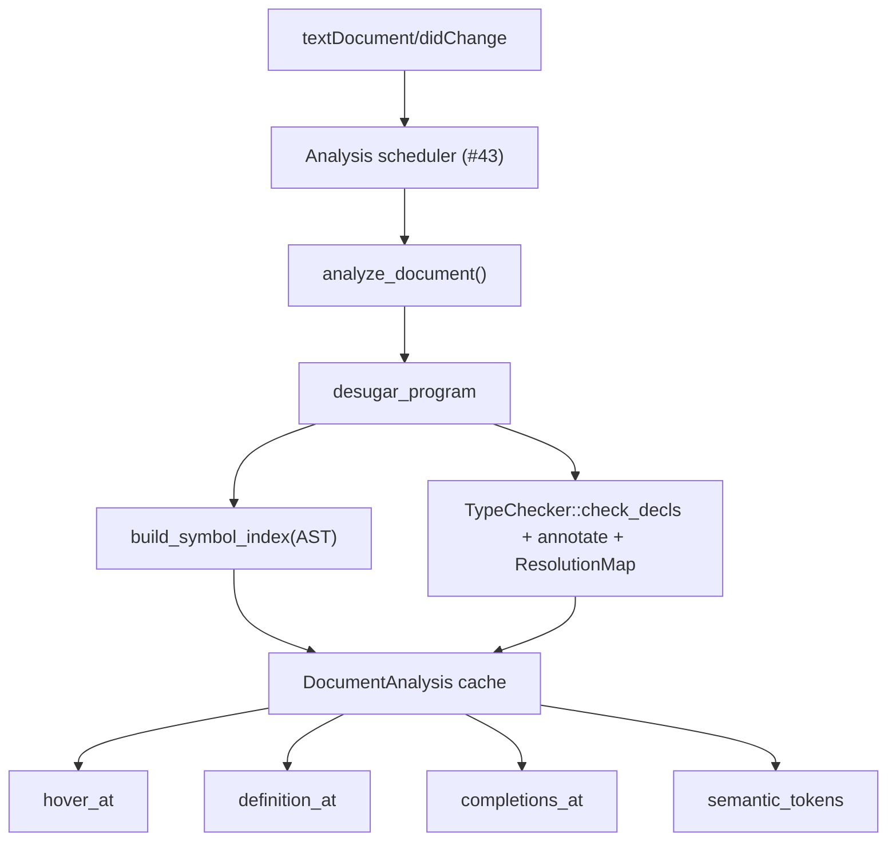

# Issue #45 — LSP language intelligence plan

**Audience**: an AFK agent implementing hover, completion, go-to-definition, and semantic tokens on branch `issue-45-lsp-intelligence`.  
**Parent**: #1 (PRD). **Blocked by**: #43 (LSP foundation), #44 (diagnostics + quick fixes).  
**Objective**: wire core language intelligence into `quon_lsp` using the existing `frontend` AST and typechecker.

**Plan status**: amended after adversarial review — see `docs/plans/issue-45-plan-review.md` (Grade C- FAIL → re-review before coding).

Read first: `CLAUDE.md`, `CONTEXT.md`, `docs/agents/code-quality.md`, `docs/agents/validation.md`, and the issue bodies for #43–#45 (`gh issue view 43 44 45`).

---

## 1. Verified current state (inspected 2026-07-08, branch `issue-45-lsp-intelligence`)

### What exists in `frontend`

| Area | Location | LSP relevance |
|------|----------|---------------|
| Spanned AST | `frontend/src/ast.rs`, `lexer::Sp<T>`, `SimpleSpan` | Every node carries byte offsets for range mapping |
| Lexer keywords | `frontend/src/lexer.rs` (`Token` enum, lines 15–34) | Completion + semantic token keyword class |
| Parser output | `parse_program` → `Vec<Sp<Decl>>` | Top-level symbol anchors |
| Desugar | `desugar_program` | `run { }` lowered before typecheck — intelligence runs on desugared tree |
| Typechecker | `frontend/src/typecheck/mod.rs` | Bidirectional Γ/Δ, alias table, gate/builtin resolution |
| Resolved types | `frontend/src/types.rs` (`Ty` + `Display`) | Hover text for inferred types |
| Builtins table | `typecheck/builtins.rs::lookup` | Classical prelude completion + hover |
| Gate table | `typecheck/circuit.rs::gate_type` | Gate completion + hover |
| Quantum prelude list | `typecheck/mod.rs::is_quantum_builtin` | Completion source (currently private — export) |
| Linear intro spans | `typecheck/linear.rs::LinEntry.intro` | Go-to-definition for linear bindings |
| Public facade | `frontend/src/lib.rs` | `parse_program`, `desugar_program`, `check_program` |
| Span-accurate tests | `frontend/tests/typecheck.rs` (`assert_span_on`) | Pattern to reuse for LSP position fixtures |

### What does **not** exist yet (assumed from #43 / #44)

- `quon_lsp` crate (stdio JSON-RPC, document cache, analysis scheduler)
- LSP position ↔ byte-offset conversion helpers
- Stable diagnostic codes (#44)
- **Any** persistent symbol table, cursor query API, or type annotation map

### Gaps this issue closes

1. **Symbol index** — definition sites for top-level fns, type aliases, params, and local/linear bindings.
2. **Position queries** — given `(uri, line, col)` or byte offset, find AST node + resolved symbol + inferred type.
3. **Four LSP handlers** — `textDocument/hover`, `definition`, `completion`, `semanticTokens/full`.
4. **Integration tests** — one test module per request type with `.qn` fixtures.

---

## 2. Architecture overview



**Design principle**: one analysis pass per edit produces a **`DocumentAnalysis`** snapshot shared by all intelligence handlers. Handlers are pure reads over the cache — no re-parse on every keystroke for hover vs completion.

**Failure tolerance**: partial/broken programs must not panic. Parse errors → empty symbol table + parse diagnostics only. Type errors → symbol table from AST still built; hover shows types where inference succeeded, `"type error"` or partial info elsewhere (#44 guarantees no panics).

**Prerequisite (M0)**: several definition sites still use bare `Name` (`String`) without spans — fn/alias names, fn params, borrow binders, monadic `Bind.param`. Symbol index and go-to-definition require `Sp<Name>` on those identifiers before M1.

---

## 3. Symbol table design

### 3.1 Data model (`frontend/src/analysis/symbols.rs`)

```rust
/// Unique id for a definition site (stable within one analysis).
pub struct SymbolId(u32);

pub enum SymbolKind {
    Function,           // top-level `fn`
    TypeAlias,          // top-level `type`
    TypeParam,          // alias param or fn value-param in `fn_sigs`
    Parameter,          // fn/lambda/borrow formal
    LocalBinding,       // let / bind / match arm / lambda param (classical, in Γ)
    LinearBinding,      // linear resource in Δ (qubit, QReg, Circuit value)
    Builtin,            // classical prelude (`builtins::lookup`)
    Gate,               // gate primitive (`circuit::gate_type`)
    QuantumBuiltin,     // qreg, measure, apply, … (`is_quantum_builtin`)
}

pub struct Symbol {
    pub id: SymbolId,
    pub name: String,
    pub kind: SymbolKind,
    /// Span of the defining identifier (not the whole decl).
    pub name_span: SimpleSpan,
    /// Enclosing scope for locals; `None` for top-level / prelude.
    pub scope: ScopeId,
    /// Filled after typecheck when available.
    pub ty: Option<Ty>,
}

pub struct Scope {
    pub id: ScopeId,
    pub parent: Option<ScopeId>,
    /// Span covering this scope's extent (for cursor → scope lookup).
    pub span: SimpleSpan,
    pub symbols: Vec<SymbolId>,  // defs introduced in this scope
}

pub struct SymbolIndex {
    pub symbols: Vec<Symbol>,
    pub scopes: Vec<Scope>,
    /// name → defs (supports shadowing: inner scope wins at query time).
    by_name: HashMap<String, Vec<SymbolId>>,
}
```

### 3.2 Construction — AST walk (pass A)

Walk `Vec<Sp<Decl>>` **after desugar**, before or in parallel with typecheck:

| AST site | Symbol inserted | `name_span` |
|----------|-----------------|-------------|
| `Decl::Fn { name, params, .. }` | `Function` + one `Parameter` per param | `name.1` (`Sp<Name>`); param `Sp<Name>` from `(Sp<Name>, Sp<Type>)` tuple (**M0**) |
| `Decl::TypeAlias { name, params, .. }` | `TypeAlias` + `TypeParam` per param | `name.1`; type-param `Sp<Name>` (**M0**) |
| `Expr::Lam { params, .. }` | `Parameter` per `Pat::Var` | pattern span |
| `Expr::Let { pat, .. }` | binding from `pat` | `Pat::Var` span |
| `Expr::Bind { param, .. }` | `LocalBinding` (monadic) | `param.1` from `Sp<Name>` (**M0** — today `param: Name` is unspanned) |
| `Stmt::Bind/Let { pat, .. }` | binding from `pat` | pattern span |
| `Match` arms | binding from arm `pat` | pattern span |
| `Expr::For { pat, .. }` | `Parameter`-like loop var | pattern span |
| `Expr::Borrow { bindings, .. }` | `Parameter` per `(Sp<Name>, Sp<Type>)` | binder `Sp<Name>` (**M0**) |
| `Type::Named { name, .. }` in type positions | **use site**, not def — resolved via alias table | — |

**Prelude symbols** (no definition span in user source): register as synthetic symbols with `name_span = SimpleSpan::empty()` (0..0) and `kind = Builtin | Gate | QuantumBuiltin`. Hover still works; go-to-definition returns `None`.

**Scope tree**: push/pop scopes at `Fn` bodies, `Lam`, `Let`, `Bind`, `Match` arms (each arm is a child scope), `RunBlock`/`CircuitBlock`/`Borrow` stmt lists, and `For` bodies.

### 3.3 Type attachment (pass B)

Extend `TypeChecker` with an optional annotation sink:

```rust
// frontend/src/analysis/annotations.rs
pub struct TypeAnnotations {
    /// Key: span of the expression/ binding use site.
    by_span: HashMap<(usize, usize), Ty>,  // (start, end) → zonked Ty
}

// In TypeChecker — at synth_var / bind_pat / check_fn_body entry:
// if let Some(ann) = &mut self.annotations {
//     ann.record(span, ty.clone());
// }
```

After `check_decls`, merge:

- **Definition types**: `Function` / `Parameter` / `LocalBinding` / `LinearBinding` ← from Γ/Δ at intro site or `fn_type_of` / alias resolution.
- **Use-site types**: lookup `TypeAnnotations` by the identifier's span for hover on references.

Expose:

```rust
pub fn analyze_program(src: &str) -> DocumentAnalysis;
```

`DocumentAnalysis` always succeeds — never `Err`. It holds `{ decls, symbols, annotations, resolutions, diagnostics, src }`. Diagnostics (parse + type) live inside the struct; callers never branch on failure.

Parse failure → `{ decls: [], symbols: empty, resolutions: empty, diagnostics: parse_diags, src }`. Type errors → partial `decls`/`symbols`/`resolutions` where construction succeeded.

### 3.4 Name resolution — checker-backed `ResolutionMap`

**Do not** implement a parallel scope-walk resolver. Resolution order in `synth_var` (`env` → `delta.try_consume` → builtins → gates → capture check → quantum prelude → unbound) is subtle; duplicating it guarantees drift.

Instead, extend `TypeChecker` with an optional sink populated during checking:

```rust
// frontend/src/analysis/resolution.rs
pub enum ResolvedTarget {
    Symbol(SymbolId),           // user binding (Γ or Δ intro)
    Builtin(&'static str),      // classical prelude
    Gate(&'static str),
    QuantumBuiltin(&'static str),
    TypeAlias(SymbolId),        // Type::Named use → alias def
}

pub struct ResolutionMap {
    /// Key: span of the identifier at the use site (Expr::Var, Type::Named name, …).
    by_use_span: HashMap<SimpleSpan, ResolvedTarget>,
}

// In synth_var — after each successful lookup branch:
// if let Some(map) = &mut self.resolutions {
//     map.record(span, ResolvedTarget::Symbol(id));  // or Builtin/Gate/…
// }
```

LSP `resolve_at(analysis, offset)`:

1. **`node_at_offset(decls, o)`** — smallest spanning node (prefer leaves).
2. Extract use-site span (ident token / `Sp<Name>` region).
3. **`analysis.resolutions.get(use_span)`** → `ResolvedTarget`.
4. Map `ResolvedTarget` → hover type + definition `name_span` via `SymbolIndex`.

Unbound names: no map entry (checker emits `TypeError::UnboundVariable`); hover shows `(unknown)`.

**Shadowing / linear consume**: guaranteed by construction — same path as typechecking. See §10.1 resolution parity tests.

---

## 4. Hover (`textDocument/hover`)

### 4.1 Handler flow

```
hover(params) → doc = cache.get(uri)
             → o = position_to_offset(doc.src, params.position)
             → analysis = doc.analysis
             → resolved = resolve_at(analysis, o)
             → markdown = format_hover(resolved, analysis)
             → Hover { contents: MarkupContent { kind: Markdown, value } }
```

Return `None` when cursor is on whitespace/comments (Quon has no line comments yet — whitespace only).

### 4.2 Content rules

Format as Markdown with a **code block for the type** (LSP convention):

| Symbol kind | Hover sections |
|-------------|----------------|
| `Function` | `(function)` + signature `Ty` via `Display` + optional **inferred body type** if differs from declared ret |
| `Parameter` / `LocalBinding` | `(parameter)` or `(variable)` + `Ty` + linearity note if `ty.is_linear_resource()` |
| `LinearBinding` | `(linear resource)` + `Ty` + *"must be consumed exactly once"* |
| `TypeAlias` | `(type alias)` + pretty-printed `ast::Type` from alias body (use `pretty::ty_str` on resolved surface type) |
| `Gate` | `(gate)` + `Circuit<n,m,d,C>` + **break out** `n`, `m`, `d`, `C` on separate lines |
| `Builtin` / `QuantumBuiltin` | `(builtin)` + scheme/type + one-line spec reference |

### 4.3 Circuit / depth / Clifford emphasis

When hovered `Ty` is `Ty::Circuit { n, m, d, c }`, append:

```markdown
**Width**: n = `{n}`, m = `{m}`
**Depth bound**: `{d}`  <!-- DepthExpr Display -->
**Clifford class**: `{c}`  <!-- Clifford | Universal, not Debug -->
```

Implement `Display` for `CliffordClass` in hover path (or map to `"Clifford"` / `"Universal"`) — avoid `{:?}` in user-facing hover (current `Ty` Display uses Debug for `c`).

For `Ty::QReg(n)`, show `**Register width**: {n}`.

### 4.4 Error / partial programs

- Unbound name at cursor → hover shows `` `(unknown)` `` with diagnostic message if available.
- Type error on node → show partial type if annotation exists, else message from `TypeError` at that span.

---

## 5. Go-to-definition (`textDocument/definition`)

### 5.1 Handler flow

```
definition(params) → o = offset(...)
                  → resolved = resolve_at(...)
                  → def = analysis.symbols[resolved.def]
                  → if def.name_span.is_empty() { return None }  // prelude
                  → Location { uri, range: span_to_range(def.name_span) }
```

### 5.2 Supported targets (acceptance scope)

| Target | Works | Notes |
|--------|-------|-------|
| Local `let` / `<-` binding use → def | ✅ | `Pat::Var` span |
| Lambda param use → def | ✅ | |
| Function call → top-level `fn` | ✅ | `Decl::Fn` name span |
| Param use inside fn → param def | ✅ | |
| Type alias use in type position → `type` decl | ✅ | `Type::Named` resolution via alias table |
| Gate / builtin use | ❌ → `None` | no user source definition |
| Linear binding (qubit in `borrow`) | ✅ | `Delta.intro` span recorded during check |

### 5.3 Multi-def / imports

Single-file LSP only (no `workspace/symbol` in this issue). No cross-file — out of scope.

---

## 6. Completion (`textDocument/completion`)

### 6.1 Context detection

Inspect token stream around cursor (re-lex `doc.src` or reuse cached tokens from analysis):

```rust
pub enum CompletionContext {
    StatementStart,       // beginning of stmt in run/circuit/block
    AfterLet,             // `let ` |
    AfterBind,            // `<-` rhs or bind target
    Expression,           // general expr position
    AfterAt,              // `@` in circuit — expect gate
    TypePosition,         // after `:` or inside `<...>`
    AfterFn,              // `fn |` — keyword snippet
    ImportPath,           // N/A — skip
}
```

Detect via: (1) leaf AST node kind at cursor, (2) preceding non-whitespace token(s), (3) parent context (`CircuitBlock` vs `RunBlock` vs classical fn body).

**Deferred**: `AfterDot` (UFCS `x.|` method completion) — no UFCS/method surface in AST or typechecker yet; see §13.

### 6.2 Suggestion sources by context

| Context | Items | `CompletionItemKind` |
|---------|-------|----------------------|
| Any | Keywords (`fn`, `let`, `circuit`, `run`, …) | `Keyword` |
| `Expression`, `StatementStart` | In-scope bindings (scope walk + prefix filter) | `Variable` |
| `Expression` | `builtins::lookup` names | `Function` |
| `Expression`, `AfterAt` | Gate names from `circuit::gate_type` + quantum combinators from `is_quantum_builtin` | `Function` / `Enum` |
| `TypePosition` | `Qubit`, `Bit`, `Int`, … + alias names from `SymbolIndex` + `Nat` | `TypeParameter` / `Class` |
| `AfterFn` | snippet `fn ${1:name}(${2:params}): ${3:Ret} = ${0:body}` | `Snippet` |

**Filter**: LSP `partialResult` optional; minimally apply prefix match on identifier under cursor (re-use lexer to get partial ident).

**Sort**: keywords < locals < functions < gates (configurable `sortText`).

**Detail**: gate items show `Circuit<1,1,1,Clifford>` in `detail`; builtins show curried type string.

### 6.3 Export helper from `frontend`

Add `frontend/src/analysis/prelude_names.rs`:

```rust
pub fn keywords() -> &'static [&'static str];
pub fn classical_builtins() -> impl Iterator<Item = &'static str>;
pub fn gates() -> impl Iterator<Item = &'static str>;
pub fn quantum_builtins() -> impl Iterator<Item = &'static str>;
```

Refactor `is_quantum_builtin` to share a single `QUANTUM_PRELUDE` table (avoid drift).

---

## 7. Semantic tokens (`textDocument/semanticTokens/full`)

### 7.1 Legend (register in `initialize` response)

| Index | LSP type | Quon syntax |
|-------|----------|-------------|
| 0 | `keyword` | `fn`, `type`, `let`, `in`, `return`, `match`, `circuit`, `run`, `borrow`, `for`, `if`, `then`, `else`, `true`, `false`, `adjoint`, `controlled`, `par` |
| 1 | `type` | Type literals (`Qubit`, `Int`, …) and `type` alias names in type positions |
| 2 | `function` | Top-level `fn` names; builtin/gate names at use sites |
| 3 | `variable` | Local bindings at def + use; wildcard `_` as `keyword` instead |
| 4 | `parameter` | Fn params, lambda params, borrow binders, `for` loop vars |
| 5 | `number` | `Int` / `Float` literals |
| 6 | `operator` | `\|>`, `-o`, `@`, `->`, `=>`, `<-`, `+`, `-`, `*`, `/`, `^`, `\|`, arithmetic in types |
| 7 | `namespace` | `Type::Named` alias references at use sites (e.g. `Oracle` in `Oracle<n>`) |

**Token modifiers** (optional v1): `definition` on def sites, `readonly` on gates — defer if time-constrained; plain types suffice for acceptance.

### 7.2 Encoder algorithm

1. Lex `src` → `Vec<Sp<Token>>`.
2. Map tokens to legend indices (keywords, operators, numbers, idents).
3. For `Token::Ident`, refine using `SymbolIndex` + context:
   - def site → apply modifier or pick `function`/`variable`/`parameter`/`type` per kind
   - use site → same kind as resolved symbol
   - unresolved ident in type context → `type` or `namespace`
4. Emit LSP **delta-encoded** `SemanticTokens { data }` per spec (5-tuple: deltaLine, deltaStart, length, tokenType, tokenModifiers).

**Overlap**: when lex class conflicts with AST (e.g. `circuit` keyword vs ident — impossible in Quon), AST wins for idents only.

### 7.3 `semanticTokens/full` vs range

Implement **`full` only** for this issue (#43 may already advertise capability). `semanticTokens/range` is a follow-up optimization.

---

## 8. Module layout

### 8.1 New `frontend` analysis module

```
frontend/src/
  analysis/
    mod.rs              // pub use + analyze_program()
    symbols.rs          // SymbolIndex builder (AST walk)
    scopes.rs           // Scope push/pop helpers
    cursor.rs           // node_at_offset, enclosing_scope, partial_ident
    annotations.rs      // TypeAnnotations + checker hook
    resolution.rs       // ResolutionMap + ResolvedTarget; populated in synth_var
    prelude_names.rs    // exported name lists for completion/tokens
```

**`frontend/src/lib.rs`**: add `pub mod analysis;` and re-export `analysis::analyze_program`, `DocumentAnalysis`.

**`TypeChecker` changes** (`typecheck/mod.rs`):

- Add `annotations: Option<TypeAnnotations>` field (default `None` — zero cost for existing tests).
- Add `resolutions: Option<ResolutionMap>` field (default `None`).
- Record types at: `synth_var`, `synth`/`check` on literals, `bind_pat`, `check_fn_body` return.
- Record resolutions at: `synth_var` (each lookup branch) and `Type::Named` alias resolution in check/synth type paths.
- Make `is_quantum_builtin` public via `analysis::prelude_names` or `typecheck::quantum_prelude`.

### 8.2 `quon_lsp` intelligence module (requires #43 crate)

```
quon_lsp/
  src/
    lib.rs
    main.rs
    server/               // from #43
      mod.rs
      lifecycle.rs
      text_sync.rs
    document.rs           // Document { src, version, analysis }
    scheduler.rs          // debounced re-analysis
    convert.rs            // offset ↔ lsp_types::Position/Range
    intel/
      mod.rs
      hover.rs
      definition.rs
      completion.rs
      semantic_tokens.rs
  tests/
    intel_hover.rs
    intel_definition.rs
    intel_completion.rs
    intel_semantic_tokens.rs
    support/
      mod.rs              // spawn server or call handlers directly
      fixture.rs          // load .qn, position marker `/*cursor*/`
  tests/fixtures/intel/
    hover_circuit.qn
    def_local.qn
    complete_gates.qn
    tokens_bell.qn
    ...
```

**Workspace `Cargo.toml`**: add `quon_lsp` member; depend on `tower-lsp` / `lsp-types`, `frontend`, `tokio`.

### 8.3 Cache integration (#43)

Extend `DocumentAnalysis` refresh in scheduler:

```rust
fn reanalyze(doc: &mut Document) {
    doc.analysis = frontend::analysis::analyze_program(&doc.src);
    doc.diagnostics = analysis.diagnostics.clone(); // #44 enriches these
}
```

Intelligence handlers read `doc.analysis` — never call `check_program` directly.

---

## 9. LSP conversion helpers (`quon_lsp/src/convert.rs`)

Quon uses **byte offsets** (`SimpleSpan` UTF-8); LSP uses UTF-16 code units.

```rust
pub fn offset_to_position(src: &str, offset: usize) -> lsp_types::Position;
pub fn position_to_offset(src: &str, pos: lsp_types::Position) -> Option<usize>;
pub fn span_to_range(src: &str, span: SimpleSpan) -> lsp_types::Range;
```

Unit-test with ASCII + one multi-byte UTF-8 fixture (if Quon source allows unicode identifiers — today identifiers are ASCII).

---

## 10. Test strategy

### 10.1 `frontend` unit tests (fast, no LSP)

| Module | Tests |
|--------|-------|
| `analysis/symbols.rs` | Bell-state fixture: expected symbol count, scope nesting, shadowing |
| `analysis/cursor.rs` | `/*cursor*/` marker → correct node kind |
| `analysis/annotations.rs` | `ty("fn f(): Int = 1")` style — inferred type at literal span |
| `analysis/resolution.rs` | **Resolution parity** — see below |
| `analysis/prelude_names.rs` | gate list matches `circuit::gate_type` keys |

**Resolution parity tests** (`frontend/tests/analysis_resolution.rs` or unit tests in `resolution.rs`): for each fixture, run `analyze_program` and assert `ResolutionMap` entries match the typechecker's binding target (not a reimplemented resolver).

| Fixture | Assert |
|---------|--------|
| Inner `let` shadows outer same name | use-site span → inner `SymbolId` |
| Linear qubit in `borrow` | use → linear binding def; double-use still maps to intro |
| Gate / classical builtin / quantum name | `ResolvedTarget` kind matches `synth_var` branch |
| `Type::Named` alias in type position | → alias `SymbolId` (needs M0 spanned alias name) |
| Unbound ident | no resolution entry |

Reuse `frontend/tests/support/mod.rs` patterns; add `cursor_at(src, marker)` helper.

### 10.2 `quon_lsp` integration tests (acceptance)

Use **direct handler invocation** (preferred over subprocess stdio — faster, no flakiness):

```rust
// Pseudocode
let (service, doc) = setup_with_source(HOVER_FIXTURE);
let hover = service.hover(HoverParams { ... }).await.unwrap();
assert!(hover.contents.contains("Circuit<1, 1, 1, Clifford>"));
```

**Fixture convention**: embed cursor as `let x = H@/*cur*/q0` or line/col constants derived from marker during test setup.

| Test file | Minimum cases |
|-----------|---------------|
| `intel_hover.rs` | (1) gate `H` shows Circuit+Clifford (2) local binding shows `Qubit` (3) fn shows declared signature |
| `intel_definition.rs` | (1) local use → `let` binding (2) call → fn def (3) builtin returns `None` |
| `intel_completion.rs` | (1) empty circuit block lists `H`, `CNOT` (2) expr lists in-scope var (3) type pos lists `Qubit` |
| `intel_semantic_tokens.rs` | (1) decode tokens for small program (2) keyword `fn` typed as keyword (3) gate typed as function |

**Snapshot optional**: `insta` for hover markdown strings (gate + fn cases).

### 10.3 Regression guards

- Run existing `cargo test --workspace --exclude flux_verify` — annotation hook must not change checker behavior when `annotations = None`.
- `npx @taskless/cli@latest check` on touched files.
- No `unwrap`/`expect` in library paths (`quon_lsp` library uses `thiserror`; `main` may use `anyhow` per repo rules).

---

## 11. Implementation milestones (Graphite-stackable)

| # | PR | Delivers |
|---|-----|----------|
| M0 | `frontend/ast` spanned definition names | `Sp<Name>` on fn name, type alias name + params, fn params, borrow binders, `Bind.param`; parser + typechecker + fixture updates |
| M1 | `frontend/analysis` skeleton + symbol index | AST walk, scopes, unit tests (**depends on M0**) |
| M2 | Resolution map + annotation hook | `ResolutionMap` in `synth_var`, `TypeAnnotations`, infallible `analyze_program()` |
| M3 | Prelude name export + cursor helpers | `node_at_offset`, name lists |
| M4 | `quon_lsp/intel/definition` + tests | First LSP feature end-to-end |
| M5 | Hover + Clifford/depth formatting | `Display` for Clifford in hover |
| M6 | Completion contexts | Keyword/gate/local suggestions (no AfterDot) |
| M7 | Semantic tokens full + legend | `initialize` legend registration |
| M8 | Polish + docs | Enable capabilities in server `#43`; tick issue checkboxes |

**Dependency**: M0 must land first. M1–M3 can land before #43 merges if `frontend`-only; M4+ needs `quon_lsp` from #43. If implementing in parallel, stub `DocumentAnalysis` in `quon_lsp` until M2 lands.

---

## 12. Capability registration (server `#43`)

Ensure `initialize` advertises:

```json
{
  "hoverProvider": true,
  "definitionProvider": true,
  "completionProvider": {
    "triggerCharacters": ["@", ":", "<"]
  },
  "semanticTokensProvider": {
    "legend": { "tokenTypes": [...], "tokenModifiers": [] },
    "full": true
  }
}
```

---

## 13. Out of scope (explicit deferrals)

- `textDocument/references`, `workspace/symbol`
- `semanticTokens/range` incremental highlighting
- Signature help (`textDocument/signatureHelp`)
- Code actions (owned by #44)
- Cross-file / multi-root workspace indexing
- Doc comments (language has none yet)
- Completion resolve / item defaults beyond `label` + `kind` + `detail`
- **UFCS / AfterDot method completion** (no method surface in language yet)

---

## 14. Risk notes

| Risk | Mitigation |
|------|------------|
| Bare `Name` on defs (no span) | **M0** — `Sp<Name>` on fn/alias/param/borrow/bind; block M1 until done |
| Parallel resolver drift | **ResolutionMap** in `synth_var`; resolution parity tests in CI |
| Checker perf on every keystroke | #43 debounce (~150–300 ms); share analysis snapshot |
| UTF-16 position drift | Centralize convert helpers; one UTF-8 test |
| `Ty::Display` Debug for Clifford | Add `CliffordClass` Display in M5 |

---

## 15. Acceptance checklist (maps 1:1 to issue)

- [ ] `textDocument/hover` returns inferred type metadata (incl. Circuit depth + Clifford breakdown)
- [ ] `textDocument/definition` works for local bindings and function symbols
- [ ] `textDocument/completion` returns context-relevant suggestions (keywords, gates, builtins, in-scope bindings)
- [ ] `textDocument/semanticTokens/full` highlights major token classes per legend §7.1
- [ ] Integration tests in `quon_lsp/tests/intel_*.rs` cover each request type
- [ ] Resolution parity tests in `frontend` assert `ResolutionMap` matches checker bindings (§10.1)

When complete: `gt submit --no-interactive --no-edit`, reference `Closes #45` in PR body.
