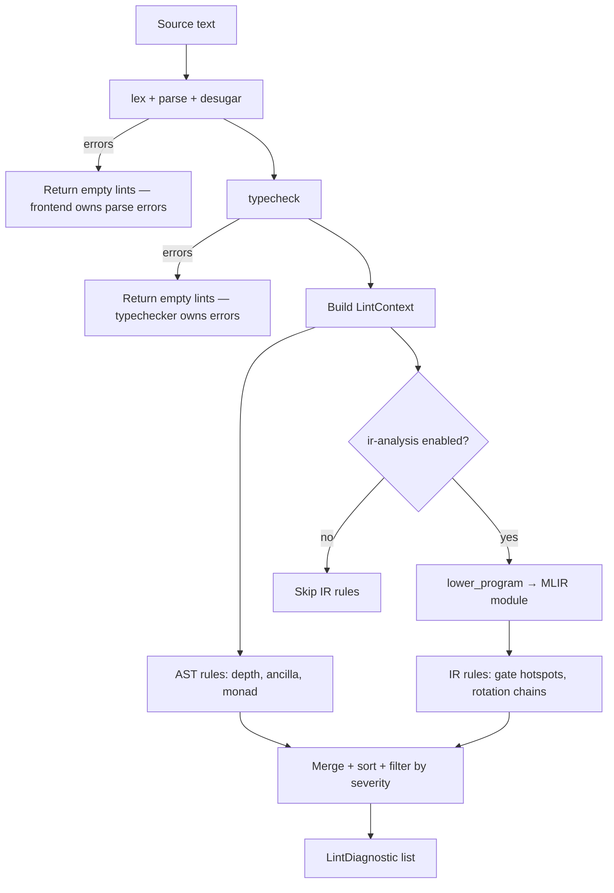

# Issue #47 — quonlint implementation plan

**Audience**: an AFK agent (or human) implementing `quonlint` on branch `issue-47-quonlint`.
**Parent**: [#1](https://github.com/arniber21/quon/issues/1) (MVP PRD).
**Blocked by**: [#43](https://github.com/arniber21/quon/issues/43) (`quon_lsp`), [#46](https://github.com/arniber21/quon/issues/46) (`quonfmt`) — this plan assumes both exist and defines integration seams only.
**Objective**: ship a lint rule engine for experiment quality and ergonomics, with CLI + LSP surfacing and CI enforcement.

Read first: `CONTEXT.md`, `SPEC.md` §3–§5 (types, borrow, monad), `docs/agents/code-quality.md`, `docs/agents/validation.md`, and the existing frontend pipeline (`frontend/src/lib.rs`, `frontend/src/diagnostics.rs`).

---

## 1. Verified current state (inspected 2026-07-08, `issue-47-quonlint`)

Do not re-derive; spot-check only what you touch.

**Already available to build on:**

| Layer | What exists | Relevance |
| ----- | ----------- | --------- |
| Frontend | `parse_program`, `desugar_program`, `check_program`, `lower_program` | Lint runs after desugar + typecheck; IR rules reuse `lower_program` |
| Diagnostics | `frontend::diagnostics::Diagnostic { message, span }` with `SimpleSpan` byte offsets | Same span model as typechecker; map to LSP line/col |
| Typechecker | Symbolic `DepthExpr` on `Ty::Circuit`, borrow escape, monad bind, recursion termination (#57–#60) | Depth/ancilla/monad rules read inferred types, not re-implement checking |
| MLIR passes | `native_gate_decomp`, `gate_cancellation`, `rotation_merging`, `depth_scheduling`, … | IR-level gate/depth analysis after partial lowering |
| Taskless | `.taskless/rules/` ast-grep on **Rust** sources | Orthogonal to quonlint (Quon **source** lints); both run in CI |
| CI | `ci.yml` (Rust), `taskless.yml` (ast-grep) | Add a quonlint job alongside these |

**Does not exist yet (this issue):**

- `quonlint` crate, config format, rule registry, CLI binary
- LSP lint hook in `quon_lsp` (planned in §6)
- CI gate on `.qn` files

**Design principle:** quonlint is **advisory quality analysis**, not a second typechecker. Rules fire only on well-typed programs. On parse/desugar or typecheck failure, return empty lints — frontend/typechecker owns those diagnostics.

---

## 2. Goals and non-goals

### Goals

1. **High-signal experiment ergonomics** — catch depth blow-ups, gate hotspots, ancilla smells, and monadic footguns early in the edit loop.
2. **Single diagnostic currency** — one `LintDiagnostic` type consumed by CLI (human + `--json`) and LSP (`textDocument/publishDiagnostics`).
3. **Configurable severities** — per-rule default + override via config and CLI.
4. **Project and file scope** — lint one file, a directory tree, or a workspace root discovered by config.
5. **CI enforcement** — PRs fail when configured severities are violated on changed `.qn` files (and optionally full scan on `main`).

### Non-goals (v1)

- Auto-fix / code actions (defer to `quonfmt` + future quick-fix issue).
- Cross-file whole-program analysis beyond “lint all files in project” (no call-graph IPO).
- Target-specific routing simulation inside lints (use static gate-name heuristics; optional `--target` for native-gate rules only).
- Replacing Taskless or Flux.

---

## 3. Crate structure

Add two workspace members:

```
quonlint/                    # library — rule engine, config, reporters
├── Cargo.toml
├── src/
│   ├── lib.rs               # pub API: lint_file, lint_project, LintConfig
│   ├── config.rs            # TOML schema, severity overrides, rule enable/disable
│   ├── context.rs           # LintContext: source, spans, typed AST, optional IR
│   ├── diagnostic.rs        # LintDiagnostic, Severity, rule id, help text
│   ├── engine.rs            # rule registry, parallel file lint, dedup
│   ├── reporter.rs          # human (ariadne), JSON, LSP payload helpers
│   ├── project.rs           # discover .qn files, load quonlint.toml, merge configs
│   └── rules/
│       ├── mod.rs           # register_rules(), Rule trait
│       ├── depth.rs         # depth growth category
│       ├── gates.rs         # non-native gate hotspots
│       ├── ancilla.rs       # borrow lifecycle
│       └── monad.rs         # run/bind misuse
└── tests/
    ├── rules/               # one test module per rule (snippet in, diags out)
    ├── project.rs             # config discovery, severity overrides
    └── snapshots/             # insta message snapshots

quonlint-cli/                # thin binary (or `[[bin]]` inside quonlint — prefer separate for fast LSP linking)
├── Cargo.toml
└── src/main.rs              # clap CLI → quonlint:: APIs
```

**Workspace `Cargo.toml`:**

```toml
members = [..., "quonlint", "quonlint-cli"]
```

**Dependencies (`quonlint`):**

| Crate | Use |
| ----- | --- |
| `frontend` | parse, desugar, typecheck, AST, `SimpleSpan` |
| `mlir_bridge` | optional `lower_program` for IR rules (feature `ir-analysis`, **default off**) |
| `backend` | `generic_openqasm::target()` for default native gate set |
| `quon_core` | `DepthExpr` eval/compare helpers |
| `thiserror`, `serde`, `toml`, `glob`, `rayon` (project lint parallelism) |
| `ariadne` | CLI human output (match `quonc` style) |

**Error handling:** library uses `thiserror`; CLI uses `anyhow` (same split as `frontend` / `quonc`).

**Public API surface (stable for LSP):**

```rust
pub struct LintConfig { /* ... */ }
pub struct LintDiagnostic {
    pub rule: RuleId,           // e.g. "depth/sequential-for-blowup"
    pub severity: Severity,     // Error | Warning | Info | Allow (filtered out)
    pub message: String,
    pub span: SimpleSpan,
    pub help: Option<String>,
}
pub fn lint_source(path: &Path, src: &str, config: &LintConfig) -> Vec<LintDiagnostic>;
pub fn lint_paths(paths: &[PathBuf], config: &LintConfig) -> Result<Vec<(PathBuf, Vec<LintDiagnostic>)>, LintError>;
pub fn lint_project(root: &Path, config: &LintConfig) -> Result<..., LintError>;
pub fn diagnostics_to_lsp(src: &str, diags: &[LintDiagnostic]) -> Vec<LspDiagnostic>; // in quon_lsp or quonlint::reporter
```

---

## 4. Analysis pipeline



**LintContext** fields:

- `source: Arc<str>`, `path: PathBuf`
- `decls: Vec<Sp<Decl>>` (desugared)
- `typed_info: TypedProgram` — new lightweight export from frontend (see §4.1)
- `mlir: Option<Module>` — populated when IR rules enabled
- `target: BackendTarget` — from config `--target` JSON or `generic_openqasm`
- `config: LintConfig`

### 4.1 Frontend seam (small PR in `frontend`)

Add a **required** `analyze_program` export that returns typed metadata lints need without duplicating inference:

```rust
pub struct TypedProgram {
    pub decls: Vec<Sp<Decl>>,
    /// Per-function inferred return `Ty` (especially `Circuit { d, ... }`).
    pub fn_types: HashMap<Name, Ty>,
    /// Per-expression synthesized types at key spans (required for monad/depth rules).
    pub expr_types: HashMap<SimpleSpan, Ty>,
}
pub fn analyze_program(src: &str) -> Result<TypedProgram, AnalyzeError>;
```

Implementation: refactor `TypeChecker::check_decls` to retain the typed tree + `fn_types` map already built in `TypeChecker::globals` / per-body synthesis, plus per-expression synthesis results. **Do not** expose the whole checker; export only what rules need.

**M2 is a hard blocker for M3–M5.** Rules must not re-walk AST and re-derive depth/types — that drifts from inference. All semantic rules consume `TypedProgram`.

### 4.2 IR analysis (optional pass)

For gate rules, call existing `frontend::lower::lower_program` on well-typed source. Walk `quantum.circ` ops:

- Count gates by name, `native_gate` attribute (post-`native_gate_decomp` with configured target).
- Detect consecutive same-axis rotations on one wire (mirror `rotation_merging` intent).

Keep IR walk **read-only**; do not run the full `quonc` pass pipeline (too heavy for per-keystroke LSP). For CI/project lint, a `--deep` flag may run `native_gate_decomp` only.

---

## 5. Rule catalog (12 initial rules)

Each rule has: stable ID, category, default severity, description, implementation notes, test fixture.

Severity defaults are overridable in config (§7).

### Category A — Suspicious depth growth (`depth/*`)

| ID | Default | Description | Implementation notes |
| -- | ------- | ----------- | -------------------- |
| `depth/sequential-for-blowup` | **info** | Sequential `for pat in range(n) { body }` inside a `circuit` block multiplies depth by iteration count. | Match `Expr::For` in circuit context; emit **info** by default (idiomatic for Trotter/layer loops). Escalate to **warn** only when iteration count is non-literal **and** body depth > 1. Point at `for` keyword. Negative test: `ising.qn` must not warn. |
| `depth/unsound-depth-annotation` | **warn** | Recursive circuit function's **synthesized** step depth **exceeds** the **declared** depth bound — annotation is unsound. | Compare `FnSig.ret` circuit `d` vs synthesized depth of body at recursive call sites via `TypedProgram`. Fire only when synthesis > annotation (unsound). **Do not** flag loose upper bounds like `2*n*n` on `recursive_qft.qn` — those are proven features (#58, #60). Regression test: `refinement.rs` QFT proof must not fire. |
| `depth/repeat-non-literal-count` | **info** | `par { c } * count` or `repeat(count, c)` where `count` is not a compile-time literal — depth bound becomes symbolic and easy to mis-estimate. | Match `Par`/`repeat` with non-literal count expr. |
| `depth/controlled-chain` | **info** | Long chain of `controlled(...)` compositions — each adds +1 depth per SPEC; may indicate missed `par` opportunities. | AST walk: count consecutive `Controlled` wrappers; threshold ≥ 4 (configurable). |

### Category B — Avoidable non-native gate hotspots (`gates/*`)

| ID | Default | Description | Implementation notes |
| -- | ------- | ----------- | -------------------- |
| `gates/universal-in-clifford-block` | **warn** | Circuit block annotated or inferred `Clifford` contains `T`/`T_dag` or parametric `Rz`/`Rx`/`Ry` applications. | Gate placement / `GateApp` with universal primitives; read inferred class from `TypedProgram`. |
| `gates/non-native-density` | **warn** | After IR lowering + `native_gate_decomp`, fraction of gates still `native_gate=false` exceeds threshold (default 30%) in a single function. | Requires `--target` or default generic target; IR walk. `--deep` in CI. |
| `gates/consecutive-rotations` | **info** | Two or more parametric rotations on the same qubit index without intervening non-commuting gates — mergeable by `rotation_merging` pass. | IR or AST: same qubit index, rotation gates adjacent in circuit block. |
| `gates/swap-in-source` | **info** | Explicit `SWAP`/`swap` gate in source on a connectivity-aware target may be avoidable via routing. | Name match on gate; downgrade to allow when no target topology. |

### Category C — Ancilla lifecycle anti-patterns (`ancilla/*`)

| ID | Default | Description | Implementation notes |
| -- | ------- | ----------- | -------------------- |
| `ancilla/discard-in-borrow` | **warn** | `borrow` block terminates with `discard(q)` on a qubit that was actively used in entangling gates — prefer `reset` when reuse is intended (SPEC §5.9). | Borrow body walk: if ancilla participated in `CNOT`/controlled ops then `discard`, suggest `reset`. Typechecker allows both; lint is advisory. |
| `ancilla/nested-borrow` | **info** | Nested `borrow` blocks — harder to reason about ancilla lifetimes. | AST nesting depth > 1. |
| `ancilla/unmeasured-ancilla-output` | **warn** | Ancilla qubit bound in `borrow` appears in returned tuple without an intervening `measure`/`reset`/`discard` on that binding. | Complement typechecker's `BorrowEscape`: catch tuple returns that include ancilla names from outer borrow scope incorrectly. |

### Category D — Common monadic misuse (`monad/*`)

| ID | Default | Description | Implementation notes |
| -- | ------- | ----------- | -------------------- |
| `monad/circuit-bind-without-apply` | **error** | In `run { }`, binding `<-` a value of type `Circuit<…>` without applying it to qubits — likely forgot `@ q` / `apply_dyn`. | Type-directed: bind RHS synthesizes `Circuit`, not `Q<_>`. High signal; default **error**. |
| `monad/nested-run-block` | **info** | `run { ... run { ... } ... }` — often accidental; flatten or extract function. | AST match on nested `RunBlock` / desugared `Bind` with inner run. |
| `monad/unused-measurement` | **warn** | `measure`/`measure_all` result bound to `_` or dropped — suspicious in experiment code. | Wildcard bind on `Bit`/`List<Bit>` after measure. |

**Total: 12 rules** (≥ 8 required). All must have tests; ship with 8+ enabled by default, 4 info-level optional.

### Rule trait

```rust
pub trait LintRule: Send + Sync {
    fn id(&self) -> RuleId;
    fn category(&self) -> Category;
    fn default_severity(&self) -> Severity;
    fn description(&self) -> &'static str;
    fn run(&self, ctx: &LintContext, emit: &mut dyn FnMut(LintDiagnostic));
}
```

Register in `rules/mod.rs`; filter by `config.enabled_rules` and effective severity.

---

## 6. CLI design

Binary name: **`quonlint`** (from `quonlint-cli`).

### Invocation

```bash
# Single file (default)
quonlint path/to/file.qn

# Multiple paths
quonlint algorithms/*.qn test/verify/

# Project mode — discover quonlint.toml + all .qn under root
quonlint --project
quonlint --project ./frontend/tests/fixtures

# Config
quonlint --config quonlint.toml path.qn

# Severity filter (CLI overrides config for this run)
quonlint --max-severity warn      # hide info
quonlint --fail-on error          # exit 1 only on errors (local dev default)

# Rule selection
quonlint --only depth/sequential-for-blowup,monad/circuit-bind-without-apply
quonlint --except gates/swap-in-source

# Output
quonlint --json                     # machine-readable (LSP/CI)
quonlint --format human             # ariadne (default TTY)
quonlint --format github            # GitHub Actions annotation commands

# IR-heavy rules
quonlint --target backend.json file.qn
quonlint --deep                     # run native_gate_decomp before gate density rule

# List rules
quonlint --list-rules
```

### Exit codes

| Code | Meaning |
| ---- | ------- |
| 0 | No diagnostics at or above `--fail-on` threshold |
| 1 | Violations at or above `--fail-on` |
| 2 | Invalid config, I/O error, internal error |

**CI default:** `--fail-on warn` (see §9). Local dev default: `--fail-on error`.

### Example human output

```
warning[depth/sequential-for-blowup]: sequential `for` multiplies circuit depth by iteration count
  --> ising.qn:12:5
   |
12 |     for step in range(n_steps) { layer(n) @ q }
   |     ^^^ help: consider `par` if layers commute, or annotate explicit depth `n_steps * d_layer`
```

JSON shape (stable for LSP adapter):

```json
{
  "diagnostics": [
    {
      "rule": "depth/sequential-for-blowup",
      "severity": "warning",
      "message": "...",
      "span": { "start": 240, "end": 243 },
      "help": "..."
    }
  ]
}
```

Byte offsets match `SimpleSpan` (same as frontend) so LSP conversion stays lossless.

---

## 7. Configuration

File names (search upward from file to root): `quonlint.toml`, `.quonlintrc.toml`.

```toml
[quonlint]
# Minimum severity emitted (allow | info | warn | error)
level = "info"

# CI profile: uncomment for strict gate
# level = "warn"
# fail_on = "warn"

# Glob roots for project mode (default: "**/*.qn" excluding vendor)
include = ["**/*.qn"]
exclude = ["**/target/**", "website/**"]

# Optional backend for native-gate rules
# target = "backend/fixtures/generic.json"

[rules]
# Override default severity or disable
"depth/sequential-for-blowup" = "info"
"gates/swap-in-source" = "allow"
"monad/circuit-bind-without-apply" = "error"

[rules."gates/non-native-density"]
severity = "warn"
threshold = 0.25   # rule-specific settings
```

**Precedence:** rule defaults → config file → CLI flags.

Ship a root **`quonlint.toml`** for this repo linting `frontend/tests/fixtures/**/*.qn` and `test/verify/*.qn` with repo-appropriate thresholds. See §7.1 for corpus baseline strategy before enabling CI.

### 7.1 Corpus baseline strategy (required before M8)

Before enabling CI, run all rules on the 50-program corpus + SPEC §12 reference fixtures and produce a green baseline:

1. **Measure** — `quonlint --project --format json` over `frontend/tests/fixtures/**/*.qn`; capture per-file, per-rule hit counts.
2. **Baseline file** — commit `quonlint-baseline.toml` (or `insta` snapshot of hit counts) documenting expected warnings per fixture.
3. **Suppressions** — use inline `# quonlint-disable rule-id` (file scope) or `# quonlint-disable-next-line rule-id` (line scope) for intentional demo patterns. Suppressions ship in **v1**, not v1.1 — CI depends on them.
4. **Rule tuning** — demote or disable rules that fire on idiomatic Quon (see §5 amendments: `sequential-for-blowup` → info, `quadratic-recursion-gap` → `unsound-depth-annotation`).
5. **Gate** — M8 (CI) is blocked until baseline is green at `--fail-on warn`. Do not merge CI workflow until step 1–4 complete.

Config DTOs must use `#[serde(deny_unknown_fields)]` and `thiserror` errors (Taskless rules apply to new `quonlint/src/**`).

---

## 8. LSP integration (with `quon_lsp` #43)

Assume `quon_lsp` already has: stdio JSON-RPC, `textDocument/didOpen|didChange|didClose`, incremental sync, analysis scheduler calling `frontend::check_program`.

### Hook point

In `quon_lsp`'s analysis worker, after successful typecheck:

```rust
let config = workspace_config_for_uri(&uri); // merged quonlint.toml
let lints = quonlint::lint_source(path, text, &config);
let lsp_diags = quonlint::reporter::to_lsp(text, &lints);
client.publish_diagnostics(uri, merge(type_diags, lsp_diags), version);
```

### Mapping

| `LintDiagnostic` | LSP `Diagnostic` |
| ---------------- | ------------------ |
| `severity` | `DiagnosticSeverity` (Error=1, Warning=2, Info=3, Hint=4) |
| `message` | `message` |
| `span` (byte) | `range` via line-index cache (same as type errors) |
| `rule` | `code: StringValue(rule_id)` |
| `help` | `relatedInformation` or suffix in `message` |

**Merge policy:** type errors suppress redundant lints on same span (optional dedup by overlapping range).

### Performance budget

- AST-only rules: run on every analysis cycle (target < 50 ms for ~500 LOC files).
- IR rules: debounce or run only on save / `quonlint.run` command when `--deep` equivalent is set in LSP config `"quonlint.deepAnalysis": false` default.

Add LSP config keys in `quon_lsp`:

```json
"quonlint.enable": true,
"quonlint.configPath": null,
"quonlint.deepAnalysis": false
```

---

## 9. Taskless and CI integration

### Relationship to Taskless

| Tool | Scope | When |
| ---- | ----- | ---- |
| Taskless | Rust sources (`.rs`) | PR diff + main full scan |
| quonlint | Quon sources (`.qn`) | PR diff + optional main full scan |

No Taskless rule replaces quonlint. Update `docs/agents/validation.md` CI matrix with a quonlint row.

### New workflow: `.github/workflows/quonlint.yml`

```yaml
name: quonlint
on:
  push:
    branches: [main]
  pull_request:

jobs:
  lint:
    runs-on: ubuntu-latest
    steps:
      - uses: actions/checkout@v4
        with:
          fetch-depth: 0
      - uses: dtolnay/rust-toolchain@stable
      - uses: Swatinem/rust-cache@v2
      # Install LLVM 22 + MLIR + libz3 (match ci.yml exactly, including libz3-dev)
      - name: Install LLVM 22 + MLIR + libz3
        run: ... # copy ci.yml install block verbatim (includes libz3-dev)
      - name: Build quonlint
        run: cargo build --release -p quonlint-cli
      - name: quonlint (PR diff)
        if: github.event_name == 'pull_request'
        run: |
          git fetch origin "${{ github.base_ref }}" --depth=1
          FILES=$(git diff --name-only "origin/${{ github.base_ref }}...HEAD" -- '*.qn')
          if [ -n "$FILES" ]; then
            target/release/quonlint --fail-on warn --format github $FILES
          fi
      - name: quonlint (main push, project)
        if: github.event_name == 'push'
        run: target/release/quonlint --project --fail-on warn
```

**Pre-PR checklist** (`docs/agents/code-quality.md`): add step 4b — `cargo run -p quonlint-cli -- --project` (or diff-scoped).

### Optional: pre-commit

Document only (do not add Husky unless requested):

```bash
quonlint $(git diff --cached --name-only -- '*.qn')
```

---

## 10. Test strategy

### 10.1 Per-rule unit tests (`quonlint/tests/rules/`)

Pattern (mirror `frontend/tests/typecheck.rs`):

```rust
fn lint_snippet(src: &str) -> Vec<LintDiagnostic> {
    quonlint::lint_source(Path::new("test.qn"), src, &LintConfig::default())
}

#[test]
fn sequential_for_emits_warning() {
    let diags = lint_snippet(r#"fn f(n: Nat): Circuit<n,n,_,Universal> = circuit {
        for i in range(n) { H @0 }
    }"#);
    assert_eq!(diags[0].rule, "depth/sequential-for-blowup");
}
```

Each rule: **positive** (violation), **negative** (clean), **edge** (boundary threshold).

### 10.2 Snapshot tests

`insta` snapshot diagnostic messages (not spans) for stable wording.

### 10.3 Fixture corpus

Run quonlint on `frontend/tests/fixtures/corpus/*.qn`:

- Expect **zero errors** on reference-quality files (adjust severities or allowlist if intentional demos violate info rules).
- Store `insta` snapshot of rule hit counts per fixture for regression.

### 10.4 CLI integration tests (`quonlint-cli/tests/`)

- `--fail-on warn` exit code 0/1
- `--json` schema smoke
- `--project` discovers fixtures
- `--list-rules` prints 12 IDs
- inline suppression: `# quonlint-disable-next-line` suppresses next line only

### 10.5 LSP tests (in `quon_lsp`, coordinated with #43)

- Open `.qn` document with known lint → `publishDiagnostics` contains rule code
- Incremental edit clears/replaces lint diagnostics

### 10.6 CI self-test

The quonlint workflow itself is the integration test on PRs.

---

## 11. Implementation milestones (Graphite-friendly)

Stack on `main` via `gt sync` → `gt create`. Suggested slices:

| # | Branch | Deliverable |
| - | ------ | ----------- |
| M1 | `47-quonlint-scaffold` | `quonlint` + `quonlint-cli` crates, `LintDiagnostic`, config parse, `--list-rules`, empty engine |
| M2 | `47-quonlint-frontend-seam` | **Required:** `frontend::analyze_program` / `TypedProgram` export (`fn_types` + `expr_types`). **Blocks M3–M5.** |
| M3 | `47-quonlint-depth-rules` | 4 depth rules + tests |
| M4 | `47-quonlint-gates-ancilla` | 4 gate + 3 ancilla rules + IR walk behind feature |
| M5 | `47-quonlint-monad-rules` | 3 monad rules + tests |
| M6 | `47-quonlint-cli-project` | project discovery, `--json`, `--format github`, root `quonlint.toml`, inline suppressions |
| M6.5 | `47-quonlint-lsp-mapping` | `quonlint` unit tests for byte-span → line/col mapping (no `quon_lsp` required) |
| M7 | `47-quonlint-lsp` | `quon_lsp` hook + config (depends on #43 landing) |
| M7.5 | `47-quonlint-corpus-baseline` | corpus baseline + suppressions green at `--fail-on warn` |
| M8 | `47-quonlint-ci` | workflow + `validation.md` update (blocked on M7.5) |

M1 scaffold is safe to prototype. **M3–M5 blocked on M2.** M6–M6.5 satisfy CLI acceptance without #43. M7 integrates LSP. M8 completes CI criterion only after corpus baseline (M7.5).

---

## 12. Validation before submit

Per `docs/agents/code-quality.md`:

```bash
cargo fmt --all -- --check
cargo clippy --workspace --exclude flux_verify --all-targets -- -D warnings
cargo test --workspace --exclude flux_verify
cargo run -p quonlint-cli -- --project
npx @taskless/cli@latest check $(git diff --name-only main...HEAD)
```

---

## 13. Acceptance criteria mapping

| Criterion | How met |
| --------- | ------- |
| Lint CLI runs on single file and project scope | §6 `quonlint file.qn`, `--project` |
| Rule severities configurable | §7 `quonlint.toml` + CLI `--fail-on` / per-rule overrides |
| ≥ 8 high-signal rules | §5 — 12 rules specified |
| Lint output consumable by LSP | §8 JSON + `to_lsp()` mapping; byte spans = `SimpleSpan`; M6.5 mapping tests without `quon_lsp` |
| CI job enforces lint on PRs | §9 `quonlint.yml` diff-scoped on `*.qn` |

---

## 14. Inline suppressions (v1, required for CI)

Ship suppression directives in v1 — CI cannot land without them:

```quon
# quonlint-disable depth/sequential-for-blowup   // file scope (first line)
# quonlint-disable-next-line depth/controlled-chain
for step in range(n_steps) { layer(n) @ q }
```

Parser: strip comments matching `# quonlint-disable(-next-line)? <rule-id>` before rule dispatch; track active file-level disables.

## 15. Open questions (resolve during M1, not blockers)

1. **IR in LSP default off** — confirm with editor latency measurements (default: off; opt-in via `quonlint.deepAnalysis`).
2. **Single-pass pipeline** — reuse one `TypeChecker` instance; optional `LoweringCtx` reuse for `--deep`; no double `check_program`.

---

## 16. References

- Issue [#47](https://github.com/arniber21/quon/issues/47)
- LSP foundation [#43](https://github.com/arniber21/quon/issues/43)
- Formatter [#46](https://github.com/arniber21/quon/issues/46)
- Borrow / ancilla: `SPEC.md` §3.4, `frontend/tests/fixtures/error_correction.qn`
- Depth algebra: `quon_core/src/depth.rs`, `frontend/src/typecheck/tests.rs` (recursive QFT)
- MLIR passes: `mlir_bridge/src/passes/mod.rs`
- Taskless: `.taskless/rules/`, `docs/agents/validation.md`
