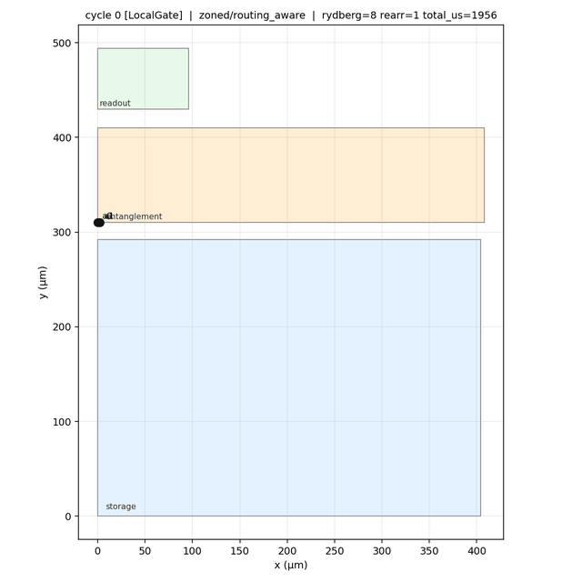

# Quon Hamiltonian-simulation reproduction experiment

## Scope

I reproduced the two-spin digital Ising example from B. P. Lanyon *et al.*,
[*Universal digital quantum simulation with trapped ions*](https://arxiv.org/abs/1109.1512),
*Science* **334**, 57–61 (2011), DOI
[10.1126/science.1208001](https://doi.org/10.1126/science.1208001).

The Quon work used only the published language documentation and `quonc --help`:
the circuit, qubit/linearity, parallel-composition, depth, monad, quickstart,
backend, and neutral-atom cookbook pages. I did not inspect Quon implementation
source to author or debug the program.

The paper-specific derivation, convention, and fidelity boundary are in
[`hamiltonian-simulation-lanyon-2011.md`](./hamiltonian-simulation-lanyon-2011.md).

## Circuit

[`samples/research/lanyon_2011_ising.qn`](../samples/research/lanyon_2011_ising.qn)
implements the paper's dimensionless two-spin Hamiltonian

$$
\widetilde H = B(Z_0+Z_1)+JX_0X_1,
$$

with the paper's relative coupling $B=1/2$, $J=1$, total phase
$\tau=\pi/2$, and four first-order Trotter steps. Each step is

$$
e^{-iB\tau(Z_0+Z_1)/4}e^{-iJ\tau X_0X_1/4}.
$$

`field_layer` uses `par { rz(theta) } * 2`; `xx_interaction` uses parallel
Hadamard basis changes around `CNOT |> Rz |> CNOT`; `evolve` uses a `Nat`
parameter, symbolic `steps * 6` depth, compile-time float arithmetic, and
`repeat`. `main` crosses into the `Q<List<Bit>>` monad, allocates a linear
`QReg<2>`, measures it, and returns only classical bits. `x_readout` tests
basis-change composition immediately before the linear measurement boundary.

This is a first-order product-formula reproduction, not exact continuous-time
evolution at four steps. It is also a portable gate decomposition, not a
reproduction of the trapped-ion pulse sequence or its reported process
fidelity.

## Generated artifacts and checks

| Artifact | Observed result |
| --- | --- |
| [`lanyon_ising.qasm`](../samples/research/artifacts/lanyon_2011/lanyon_ising.qasm) | OpenQASM 3.0; four $R_z(\pi/8)$ field pairs, four $R_z(\pi/4)$ interaction centers, eight `cx`, final measurements. The optimizer cancelled the last interaction's basis-exit `H` layer against `x_readout`. |
| [`lanyon_ising.na.mlir`](../samples/research/artifacts/lanyon_2011/lanyon_ising.na.mlir) | Canonical `quantum.na` schedule IR. |
| [`lanyon_ising.schedule.json`](../samples/research/artifacts/lanyon_2011/lanyon_ising.schedule.json) | Zoned, routing-aware schedule for two atoms; 94 cycles, eight Rydberg stages, one rearrangement, four trap transfers, and 1956 us estimated total time. |
| [`lanyon_ising.resource.md`](../samples/research/artifacts/lanyon_2011/lanyon_ising.resource.md) | Analytic schedule report: 0.933567484233 estimated fidelity. This is a compiler analytic estimate, not a sampled logical result or a comparison to the paper's ion-trap fidelity. |

The schedule renders directly with `python/visualize_na_schedule.py` — no
separate viewer needed. Sampled frames from
[`lanyon_ising.schedule.json`](../samples/research/artifacts/lanyon_2011/lanyon_ising.schedule.json),
animated across cycles:



```sh
python/visualize_na_schedule.py \
  samples/research/artifacts/lanyon_2011/lanyon_ising.schedule.json \
  -o /tmp/lanyon_ising --format png
```

Commands exercised:

```sh
cargo run -p quonc -- samples/research/lanyon_2011_ising.qn \
  --emit-qasm --metrics --verify-linear

cargo run -p quonc -- samples/research/lanyon_2011_ising.qn \
  --target targets/neutral_atom/generic_rna_v0.json \
  --na-backend zoned --na-placer routing-aware \
  --emit-na-mlir samples/research/artifacts/lanyon_2011/lanyon_ising.na.mlir \
  --emit-na-schedule samples/research/artifacts/lanyon_2011/lanyon_ising.schedule.json \
  --emit-resource-report samples/research/artifacts/lanyon_2011/lanyon_ising.resource.md \
  --verify-na --metrics
```

The fixed-target compilation emitted 34 optimized gates, depth 23, zero swaps,
and completed in 56 ms. The neutral-atom command reported `quantum.na
verification passed (physical)` and produced the artifacts above.

Using the documented Aer bridge with the project `.venv` and
`QUONC=target/debug/quonc` produced 4096 deterministic samples:

```text
00: 1918
11: 1903
10: 141
01: 134
```

This is an execution smoke test of the emitted circuit; it is not an
exact-dynamics error bound.

## Usability findings

**Smooth:** The language pages made the circuit structure direct to write.
The `Circuit<n, m, d, C>` examples established the required width, depth, and
classification contracts; `par` made the two single-qubit field and basis
layers explicit; `repeat` gave the symbolic four-step evolution without
unrolling it in source. The quickstart and backend pages gave exact working
OpenQASM, Aer, neutral-atom, resource-report, and verifier invocations. The
CLI help made the distinction between `--emit-na-mlir` (canonical artifact) and
`--emit-na-schedule` (visualization envelope) unambiguous.

**Friction observed:** Quon source comments written as `//` were rejected by a
precise parse error at the first `/`; no comment syntax was stated in the
language pages I used. An exploratory six-spin, second-order Strang circuit
wrapped in `controlled(evolve(...))` typechecked but failed during elaboration
with `elaboration is not implemented for circuit body expression during
elaboration`, pointing only to the first function. That message identified an
unsupported elaboration path but did not isolate the `controlled` composition
or suggest a supported rewrite. I removed that exploratory circuit rather than
claim it as a working reproduction.

The Aer bridge first named the missing `quonc` executable and prescribed the
`QUONC` remedy. With that variable set, it then named the missing system-Python
`qiskit-aer` dependency and gave the exact install package. The documented
project `.venv` already had the dependency and the same command succeeded.
Those errors were actionable and significantly easier to recover from than the
elaboration diagnostic.

`just ci-samples` was not available in the ambient shell. The installation documentation recommends Devbox; `devbox run -- just ci-samples` then passed all 29 catalog checks, including the new smoke-compile entry. The setup guidance therefore supplied a working recovery path, although the direct command alone was not self-sufficient in this environment.

**Conclusion:** The documented workflow is smooth for a product-formula circuit
with parametric widths/depths, parallel composition, linear measurement, QASM,
and neutral-atom scheduling. The main limitation found is advanced combinator
composition: it is documented at the type level but the failed controlled,
parametric circuit did not provide a localized elaboration diagnostic.
