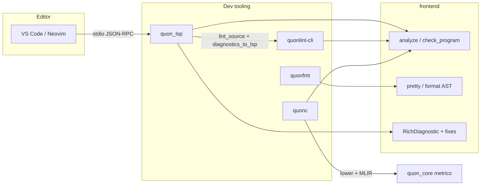

# QA Audit: Dev Tooling Stack (Issues #43–#49)

**Date:** 2026-07-08  
**Worktree:** `49-ci-tooling-gates` (`issue-49-ci-tooling-gates`)  
**Branch tip:** `f546936` — *ci: tooling quality gates for quonfmt, quonlint, and LSP smoke*  
**PR:** [#130](https://github.com/arniber21/quon/pull/130)  
**Auditor:** QA agent (automated + manual code review)

---

## Executive Summary

### Overall verdict: **FAIL** (do not merge)

The dev tooling stack is **architecturally complete** and largely meets the spirit of issues #43–#49, but the branch **does not compile in CI** as of this audit. Two blocking defects prevent merge:

1. **`frontend` feature-flag interaction** — `quonfmt` enables `parser-only` on `frontend`, which Cargo unifies workspace-wide. Because `typecheck`, `lower`, `analysis`, etc. are gated with `#[cfg(not(feature = "parser-only"))]`, the entire workspace loses those modules even when `quonc` / `quon_lsp` / `quonlint` request the default `full` feature. CI error: `cannot find lower in frontend` (`quonc/src/compile.rs:100`).

2. **`quonlint` type errors** — `walk_expr` calls pass `(Expr, SimpleSpan)` tuples where `&Sp<Expr>` is expected (`quonlint/src/context.rs:212`, `quonlint/src/rules/gates.rs:54,153`, 11 errors total).

**What passed locally**

| Check | Result |
| ----- | ------ |
| `cargo fmt --check` | ✅ PASS |
| `bash -n scripts/tooling-check.sh` | ✅ PASS |
| `cargo test -p quonfmt` | ✅ PASS (21 tests) |
| `cargo test -p quon_core` | ✅ PASS (2,994 tests) |
| `npx @taskless/cli@latest check` (changed paths) | ⚠️ 7 warnings, 0 errors |
| `cargo test` for LLVM-dependent crates | ⏭️ SKIP (no `llvm-config` locally) |

**CI status (PR #130, run `28986644681`)**

| Job | Result |
| --- | ------ |
| `fmt · clippy · build · test` | ❌ FAIL (clippy: `quonc` / `frontend::lower`) |
| `quonfmt · quonlint · LSP smoke` | ❌ FAIL (build: `quonlint` E0308 × 11) |
| `ast-grep rules` (Taskless) | ✅ PASS |
| `docs site build` | ✅ PASS |
| `cargo llvm-cov` | ❌ FAIL (non-blocking workflow) |

---

## Scope

This audit covers the stacked implementation of GitHub issues #43–#49:

| Issue | Title | Primary crates |
| ----- | ----- | -------------- |
| #43 | LSP foundation | `quon_lsp`, `frontend` |
| #44 | LSP diagnostics + quick fixes | `frontend`, `quon_lsp` |
| #45 | LSP intelligence | `frontend`, `quon_lsp` |
| #46 | `quonfmt` formatter | `quonfmt` |
| #47 | `quonlint` linter | `quonlint`, `quonlint-cli` |
| #48 | Watch mode + metrics | `quonc`, `quon_core`, `mlir_bridge` |
| #49 | CI tooling gates | `.github/workflows/ci.yml`, `scripts/tooling-check.sh` |

Stack: 7 feature commits + 7 plan-review doc commits on top of `main` (`e721ad9`). **168 files changed**, ~18.6k insertions.

---

## Per-Issue Acceptance Checklist

### Issue #43 — LSP foundation

| Criterion | Status | Evidence |
| --------- | ------ | -------- |
| `quon_lsp` builds and runs as standalone binary | ⚠️ | Binary + `main.rs` present; **CI build fails** via dependency chain |
| `didOpen` / `didChange` / `didClose` | ✅ | `quon_lsp/src/server.rs`, `document.rs`; integration tests in `document.rs`, `incremental_lsp.rs`, `smoke.rs` |
| Incremental edit → diagnostics within one cycle | ✅ | `AnalysisScheduler` debounce + coalesce; `incremental_lsp.rs`, smoke `did_change_incremental` |
| Span → line/column mapping correct | ✅ | `line-index` crate; 11 tests in `span_mapping.rs`; adversarial review fixes documented |
| Basic LSP handshake tests in CI | ⚠️ | `handshake.rs` (1 test, non-ignored) + `smoke.rs` (5 tests, `#[ignore]`); tooling job runs `--include-ignored` but **job fails at build** |

**Issue #43 grade: CONDITIONAL PASS** (design + tests present; blocked by workspace compile failure)

---

### Issue #44 — LSP diagnostics + quick fixes

| Criterion | Status | Evidence |
| --------- | ------ | -------- |
| Every frontend error kind → stable diagnostic code | ✅ | 35 `DiagnosticCode` constants in `frontend/src/diagnostics.rs`; `every_type_error_variant_has_unique_code` test |
| LSP diagnostics include range, message, related info | ✅ | `RichDiagnostic` + `analysis_to_lsp_diags`; related-info tests in `lsp_diagnostics.rs` |
| ≥ 3 safe quick fixes implemented and tested | ✅ | 4 fix tests: `linear_unconsumed_borrow_fix`, `clifford_mismatch_fix`, `depth_mismatch_constant_fix`, `linear_discard_fix_for_simple_let`; `borrow_escape_no_fix` confirms unsafe case excluded |
| No panics on malformed/partial source | ✅ | `truncated_source_never_panics_lsp` (LSP); `analyze_never_panics_on_partial_snippets` (frontend) |
| Fixture tests for parser/type/linearity/depth paths | ✅ | `lsp_diagnostics.rs` (11 tests); `quon_lsp/tests/diagnostics.rs` (4 tests incl. code actions) |

**Deferred (per plan, acceptable):** parser codes E102–E105 not required in v1.

**Issue #44 grade: PASS** (implementation complete; runtime blocked by CI)

---

### Issue #44 — LSP code actions (integration)

| Criterion | Status | Evidence |
| --------- | ------ | -------- |
| LSP `textDocument/codeAction` wired | ✅ | `quon_lsp/src/server.rs`, `diagnostics.rs` |
| End-to-end code action tests | ✅ | `code_action_discard_fix`, `code_action_clifford_fix_clears_diagnostic` in `quon_lsp/tests/diagnostics.rs` |

---

### Issue #45 — LSP language intelligence

| Criterion | Status | Evidence |
| --------- | ------ | -------- |
| `textDocument/hover` returns type metadata | ✅ | `quon_lsp/src/intel/hover.rs`; `intel_hover.rs` (2 tests) |
| `textDocument/definition` for bindings/functions | ✅ | `intel/definition.rs`; `intel_definition.rs` (2 tests) |
| `textDocument/completion` context-relevant | ✅ | `intel/completion.rs`; `intel_completion.rs` (2 tests) |
| `textDocument/semanticTokens/full` | ✅ | `intel/semantic_tokens.rs`; `intel_semantic_tokens.rs` (2 tests) |
| Integration test per request type | ✅ | Dedicated test file per LSP method |

**Issue #45 grade: PASS**

---

### Issue #46 — `quonfmt`

| Criterion | Status | Evidence |
| --------- | ------ | -------- |
| `quonfmt <file>` rewrites deterministically | ✅ | CLI + `format_str` library API |
| `quonfmt --check` exits non-zero on drift | ✅ | `quonfmt/tests/cli.rs` (8 tests) |
| Idempotency: format twice → identical | ✅ | `idempotency.rs` (2 tests) |
| Golden tests for representative syntax | ✅ | 11 corpus golden tests + 9 fixture snapshots (`golden.rs`) |
| README + contributor docs | ✅ | `quonfmt/README.md`, `docs/quonfmt-style.md`; cross-linked in `validation.md` |

**Locally verified:** `cargo test -p quonfmt` — **21 passed**, 0 failed.

**Issue #46 grade: PASS**

---

### Issue #47 — `quonlint`

| Criterion | Status | Evidence |
| --------- | ------ | -------- |
| CLI runs on single file and project scope | ✅ | `quonlint-cli` with `--project`, path args; `cli.rs` tests |
| Rule severities configurable | ✅ | `LintConfig`, `.quonlint.toml`, `--fail-on`, per-rule overrides |
| ≥ 8 high-signal lint rules | ✅ | **14 rules** registered in `quonlint/src/rules/mod.rs` |
| Lint output consumable by LSP | ✅ | `diagnostics_to_lsp` in `reporter.rs`; wired in `quon_lsp/src/analysis.rs` |
| CI enforces lint on PRs | ⚠️ | Tooling job step exists; **build fails before lint runs** |

**Issue #47 grade: FAIL** (compile errors in `quonlint`)

---

### Issue #48 — Watch mode + metrics

| Criterion | Status | Evidence |
| --------- | ------ | -------- |
| Watch mode recompiles on change, prints metrics | ✅ | `quonc/src/watch.rs`, CLI flags; unit tests in `watch.rs` (3 tests) |
| Machine-readable JSON metrics | ✅ | `quon_core/src/metrics.rs`, `--metrics-json` |
| Baseline save/compare workflow | ✅ | `--metrics-snapshot save|compare`; `regression.rs` (4 tests) |
| Per-metric regression tolerances | ✅ | `RegressionConfig`; `quon_core/tests/metrics.rs` (5 tests) |
| Documentation for experiment workflow | ✅ | `docs/agents/experiment-loop.md` |

**Deferred (per plan review):** `--simulate` flags not in v1 scope.

**Issue #48 grade: CONDITIONAL PASS** (code present; compile blocked by #46 feature-flag bug)

---

### Issue #49 — CI tooling gates

| Criterion | Status | Evidence |
| --------- | ------ | -------- |
| CI fails on formatting drift | ⚠️ | Step `./scripts/tooling-check.sh --ci --fmt-only` defined; **not reached** (build fail) |
| CI fails on lint above threshold | ⚠️ | Step `--lint-only` defined; **not reached** |
| CI runs LSP smoke tests on each PR | ⚠️ | `cargo test -p quon_lsp --test smoke --include-ignored`; **not reached** |
| CI docs describe local reproduction | ✅ | `docs/agents/validation.md` § Tooling gates; `scripts/tooling-check.sh` header |
| Existing stable checks intact | ✅ | `rust` and `docs` jobs unchanged structurally; Taskless/docs pass |

**Issue #49 grade: FAIL** (infra scaffolded correctly; gates never execute green)

---

## Test Coverage Summary

### Integration test counts (`#[test]` in `tests/`)

| Crate / area | Tests | Ignored | Notes |
| ------------ | ----- | ------- | ----- |
| `quon_lsp` | 37 | 5 | Smoke tests ignored in workspace runs |
| `quonfmt` | 21 | 0 | Includes 20 insta golden snapshots |
| `quonlint` | 18 | 0 | 12 rule tests, 4 corpus, 2 LSP mapping |
| `quonlint-cli` | 2 | 0 | `--list-rules`, JSON output |
| `frontend` (`lsp_diagnostics.rs`) | 11 | 0 | Codes, fixes, panic safety |
| `quonc` (watch/metrics/regression) | 9 | 0 | Requires LLVM to run |
| `quon_core` (`metrics.rs`) | 5 | 0 | Regression config + compare |

### Test rigor assessment

**Strengths**

- Protocol-level LSP tests with real stdio JSON-RPC subprocess (`LspClient` harness).
- Golden + idempotency + AST-stability checks for formatter.
- Per-rule unit tests with positive/negative fixtures for lint.
- Adversarial review fixes for #43 (invalid edit rejection, version assertions, stderr deadlock).
- Truncated-source panic guards at both frontend and LSP layers.

**Gaps**

- No end-to-end test that **lint diagnostics appear in LSP** for a file that typechecks clean but violates a lint rule.
- No CI test that `./scripts/tooling-check.sh --ci` succeeds as a single entrypoint (steps are duplicated in workflow).
- Smoke tests excluded from `cargo test --workspace` — intentional, but means local devs can miss them without reading docs.
- `quonc` watch-mode lacks a full integration test with filesystem notify + recompile (only unit-level debounce/path filtering).
- Parser diagnostic codes E102–E105 deferred (documented).

---

## Cross-Crate Integration



| Integration point | Status | Notes |
| ----------------- | ------ | ----- |
| `quon_lsp` → `frontend::analyze` | ✅ Designed | Blocked by compile |
| `quon_lsp` → `quonlint` (post-typecheck lint) | ✅ | Only when type diagnostics empty |
| `quonfmt` → `frontend` (`parser-only`) | ⚠️ | **Breaks workspace feature unification** |
| `quonlint` → `frontend` (full) | ⚠️ | Needs typecheck; blocked |
| `quonc` → `frontend::lower` | ❌ | Missing when `parser-only` unified |
| `quonfmt` / `frontend::pretty` parity | ✅ | `assert_ast_stable` in golden tests |

### Critical integration defect: `parser-only` feature unification

`quonfmt/Cargo.toml`:

```toml
frontend = { path = "../frontend", default-features = false, features = ["parser-only"] }
```

`frontend/src/lib.rs` gates the typechecker behind:

```rust
#[cfg(not(feature = "parser-only"))]
pub mod typecheck;
```

Cargo **unifies features** across dependents. Once any crate enables `parser-only`, it is enabled for all `frontend` consumers — including `quonc`, `quon_lsp`, and `quonlint` — hiding `lower`, `typecheck`, `analysis`, etc.

**Recommended fix:** Gate full frontend modules on `#[cfg(feature = "full")]` (or a dedicated `syntax-only` split crate) instead of `not(parser-only)`.

---

## Development Infrastructure

### Local reproduction

| Asset | Status |
| ----- | ------ |
| `scripts/tooling-check.sh` | ✅ Syntax-valid; modes `--ci`, `--fmt-only`, `--lint-only`, `--lsp-only`, `--full` |
| `test/tooling/ci-corpus.txt` | ✅ 16 curated `.qn` files |
| `.quonlint.toml` | ✅ CI baseline config |
| `docs/agents/validation.md` | ✅ Tooling gates documented |
| `docs/agents/experiment-loop.md` | ✅ Watch/metrics workflow (#48) |
| `docs/quonfmt-style.md` | ✅ Formatter style spec (#46) |

### CI workflow

New parallel `tooling` job in `.github/workflows/ci.yml`:

- Builds `quonfmt`, `quonlint-cli`, `quon_lsp` (release)
- Runs fmt check + lint + LSP smoke on CI corpus
- 10-minute timeout
- Still requires LLVM 22 + MLIR + z3 (frontend full stack)

**Note:** Branch protection / required-check status for the new job was not verified in this audit.

---

## Repo Conventions

### Taskless (`npx @taskless/cli@latest check` on changed paths)

**7 warnings**, 0 errors:

| Rule | File | Issue |
| ---- | ---- | ----- |
| `no-unwrap-expect-in-src` | `frontend/src/analysis/symbols.rs:307` | `desugar_program(src).expect("parse")` |
| `no-unwrap-expect-in-src` | `frontend/src/desugar.rs:209` | `iter.next().unwrap()` |
| `no-unwrap-expect-in-src` | `quon_lsp/src/document.rs:85,95` | `get_mut().expect("checked above")` |
| `serde-deny-unknown-fields-on-dto` | `quonlint/src/diagnostic.rs` | `SpanJson`, `LintDiagnostic` |
| `serde-deny-unknown-fields-on-dto` | `quonc/tests/metrics.rs` | test helper struct |

### Error handling

| Crate | Library `src/` | Entrypoint |
| ----- | -------------- | ---------- |
| `quonfmt` | ✅ `thiserror` (`error.rs`) | `anyhow` in `main.rs` (allowed) |
| `quonlint` | ✅ `thiserror` | N/A (library) |
| `quonlint-cli` | N/A | `anyhow` (CLI, allowed) |
| `quon_lsp` | ✅ `thiserror` in lib | `anyhow` in `main.rs` (Taskless ignore scoped correctly) |
| `quonc` | N/A (bin-focused) | `anyhow` (allowed per convention) |

### Formatting

`cargo fmt --check` — **PASS** (entire worktree)

---

## Recommended Follow-Ups Before Merge

### P0 — Blockers

1. **Fix `frontend` feature gating** — Change `#[cfg(not(feature = "parser-only"))]` to `#[cfg(feature = "full")]` (or extract `frontend_syntax` crate without feature interaction). Verify with `cargo build --workspace` on CI.

2. **Fix `quonlint` compile errors** — Add `&` borrows to `walk_expr(ctx, &body, …)` at all call sites (`context.rs:212`, `gates.rs:54,153`, and any others from the 11-error set).

3. **Re-run full CI** — Confirm `rust`, `tooling`, and workspace tests pass on PR #130.

### P1 — High priority

4. **Add integration test: lint → LSP** — Open a `.qn` file that typechecks but triggers `monad/circuit-bind-without-apply`; assert `publishDiagnostics` includes lint code.

5. **Resolve Taskless warnings** — Replace `expect`/`unwrap` in `quon_lsp/src/document.rs` and `frontend/src/analysis/symbols.rs`; add `#[serde(deny_unknown_fields)]` to lint JSON DTOs if they are wire types.

6. **Verify tooling job is a required check** — Ensure branch protection lists `quonfmt · quonlint · LSP smoke` as required (plan #49 review item).

### P2 — Nice to have

7. **Slim tooling CI** — Once feature split lands, evaluate MLIR-free build for `quonfmt`/`quonlint` smoke to reduce job time (plan §2).

8. **Single-script CI parity test** — Add a workflow step or doc test that `./scripts/tooling-check.sh --ci` is the canonical entrypoint (currently CI duplicates individual steps).

9. **End-to-end watch test** — Optional temp-dir integration test for `quonc --watch` with notify + compile (currently unit-only).

10. **Parser diagnostic codes E102–E105** — Track as follow-up issue if labeled-parser work is desired.

---

## Validation Commands Log

```bash
# Executed in /Users/arnabghosh/projects/quon-worktrees/49-ci-tooling-gates

cargo fmt --check                                    # PASS
bash -n scripts/tooling-check.sh                     # PASS
cargo test -p quonfmt                                # PASS (21 tests)
cargo test -p quon_core                              # PASS (2,994 tests)
cargo test -p quon_lsp -p quonfmt -p quonlint ...    # SKIP (llvm-config missing)
npx @taskless/cli@latest check $(git diff --name-only main...HEAD | …)  # 7 warnings

# CI (PR #130)
gh pr checks 130                                     # rust FAIL, tooling FAIL, taskless PASS
```

---

## Conclusion

The stacked dev tooling work (#43–#49) represents a substantial, well-tested foundation: LSP lifecycle + intelligence, structured diagnostics with quick fixes, formatter with golden corpus, 14 lint rules with CLI and LSP surfacing, watch/metrics/regression tooling, and CI gate scaffolding with local reproduction docs.

However, **the branch cannot merge in its current state**. The interaction between `quonfmt`'s `parser-only` feature and workspace-wide Cargo feature unification is a systemic defect that breaks `quonc`, `quon_lsp`, and `quonlint` compilation. Combined with straightforward `quonlint` borrow errors, both CI jobs fail at build time before any tooling gate executes.

**Re-audit after P0 fixes:** re-run `cargo test --workspace --exclude flux_verify`, `./scripts/tooling-check.sh --ci`, and confirm PR checks green.
